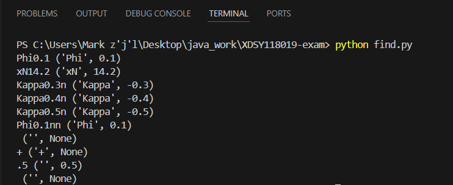
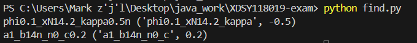
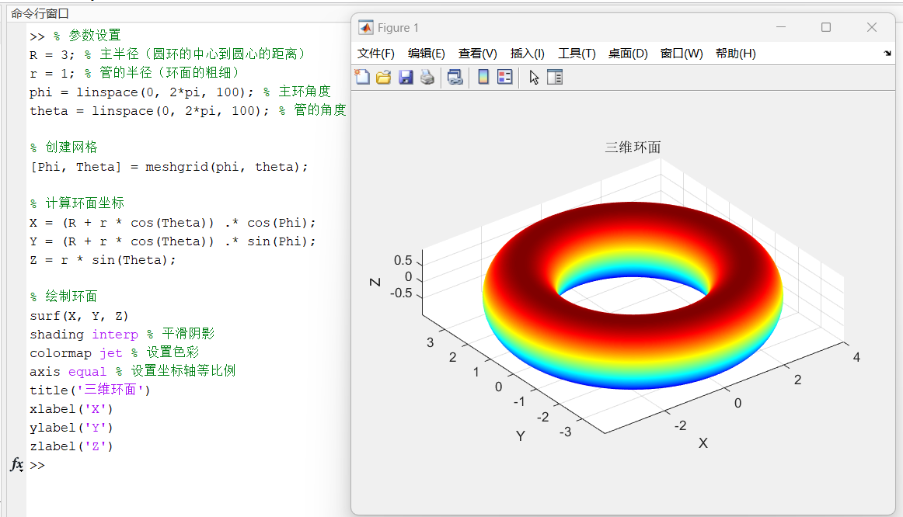
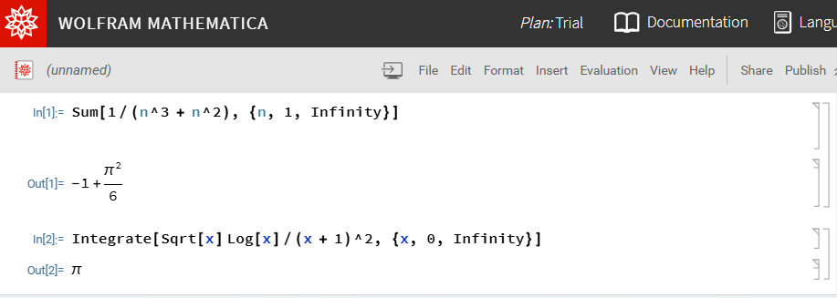

# finalexam-part2

[toc]

## 1. 请在当前目录下找到源代码文件 find\.py，并据此回答下列问题：

### 1. 请为函数find_name_value 拟一个功能描述。

- 函数功能：将数据目录的名称拆分为（name, value）元组。folder_name”的格式：<名称> <值>如果该值为负数，则后面应后跟一个‘n’。
- 例子:
    Phi0.1 #应该返回‘phi’， 0.1
    xN14.2 #应该返回‘xN’， 14.2
    Kappa0.5n #应该返回‘kappa’， -0.5

- 参数:
Folder_name (str)：术语：‘数据目录’的名称。

- 返回:
    元组：元组包含：name (str)：变量名。value (float)：变量的值。

### 2. 请设计至少10 个测试用例，其中包括正常输入、异常输入、边界输入等，并给出测试结果。根据测试结果，分析该函数的功能是否正确。如果有找到bug，试着修复它。

```python
import re

def find_name_value(folder_name):
        '''Split the name of a data directory into a (name, value) tuple.

        The format of ``folder_name``:

            <name><value>

        If the value is negative, it should be followed by a 'n'.

        Examples:
            ::

                phi0.1          # should return 'phi', 0.1
                xN14.2          # should return 'xN', 14.2
                kappa0.5n       # should return 'kappa', -0.5

        Args:
            folder_name (str): the name of a :term:`data directory`.

        Returns:
            tuple: a tuple contains:

                * name (str): variable name.
                * value (float): value of the variable.
        '''
        pattern = '([-+]?\d*\.\d+|[-+]?\d+)(n?)$'
        rst = re.split(pattern, folder_name)
        if len(rst) < 2:
            return folder_name, None
        name = rst[0]
        valuestr = rst[1]
        sign_str = ''
        if len(rst) > 2:
            sign_str = rst[2]
        if sign_str == 'n':
            value = '-' + valuestr
        else:
            value = valuestr

        return name, float(value)
```
修改正则表达式匹配结尾的数字
```python
if __name__ == '__main__':
    legal_input = ["Phi0.1", "xN14.2", "Kappa0.3n", "Kappa0.4n", "Kappa0.5n"]
    illegal_input = ["Phi0.1nn"]
    Boundary_input = ["", "+", ".5", ""]
    input_list = legal_input + illegal_input + Boundary_input
    for name in input_list:
        print(name, find_name_value(folder_name=name))
```



### 3. 请利用该函数（或经你修复的函数），找出如下文件夹名称对应的变量名和值：
- “phi0.1_xN14.2_kappa0.5n”
- “a1_b14n_n0_c0.2”

```python
if __name__ == '__main__':
    folder_name = ["phi0.1_xN14.2_kappa0.5n", "a1_b14n_n0_c0.2"]
    for name in folder_name:
        print(name, find_name_value(folder_name=name))
```



## 2. Matlab 作图。请用surf 函数渲染出如下圆环函数(环面) 的三维图像，其中𝑅 = 3, 𝑟 = 1:
\[𝑥 = (𝑅 + 𝑟 cos 𝜃) cos 𝜙\\
𝑦 = (𝑅 + 𝑟 cos 𝜃) sin 𝜙\\
𝑧 = 𝑟 sin 𝜃\]

```matlab
% 参数设置
R = 3; % 主半径（圆环的中心到圆心的距离）
r = 1; % 管的半径（环面的粗细）
phi = linspace(0, 2*pi, 100); % 主环角度
theta = linspace(0, 2*pi, 100); % 管的角度

% 创建网格
[Phi, Theta] = meshgrid(phi, theta);

% 计算环面坐标
X = (R + r * cos(Theta)) .* cos(Phi);
Y = (R + r * cos(Theta)) .* sin(Phi);
Z = r * sin(Theta);

% 绘制环面
surf(X, Y, Z)
shading interp % 平滑阴影
colormap jet % 设置色彩
axis equal % 设置坐标轴等比例
title('三维环面')
xlabel('X')
ylabel('Y')
zlabel('Z')
```



### 3. 利用Mathematica

1. 求如下无穷级数的和：
\[
\sum_{n=1}^{\infty} \frac{1}{n^3 + n^2}
\]

```mathematica
Sum[1/(n^3 + n^2), {n, 1, Infinity}]
```

1. 求如下定积分的值：
\[
\int_{0}^{\infty} \frac{\sqrt{x} \ln x}{(x + 1)^2} dx
\]

```mathematica
Integrate[Sqrt[x] Log[x]/(x + 1)^2, {x, 0, Infinity}]
```



### 4. 用LaTeX 或Markdown 或Typst 写出如下文本内容（要求渲染后的显示效果与如下文本一致）：

**$Q$**: Find the solution of the following equation with respect to $\theta$:
\[𝐴 cos 𝜃 + 𝐵 sin 𝜃 + 𝐶 = 0\]
**$A$**:
let $𝑥_1 = cos \theta$ and $𝑥_2 = sin \theta$, then the solution is given by the intersection of the circle and the line:
\[x_1^2 + x_2^2 = 1\\
Ax_1 + Bx_2 + C = 0\]
We reformulate the equations in a parametric form:
\[
\lvert x\rvert^2 = 1\\
x(t)=a+tb
\]
where $x = (𝑥_1, 𝑥_2)$, $a = (0, −𝐶/𝐵)$, $b = (−𝐶/𝐴, 𝐶/𝐵)$, and $𝑡$ is a parameter. The intersection points satisfy
the following equation:
\[
\lvert a+tb\rvert^2 = 1 
\]
which can be solved for 𝑡 to find the intersection points:
\[
t_{1,2}=\frac{-a\cdot b\pm \sqrt{(a\cdot b)-\lvert b\rvert^2(\lvert a\rvert^2-1)}}{\lvert b\rvert^2}
\]
