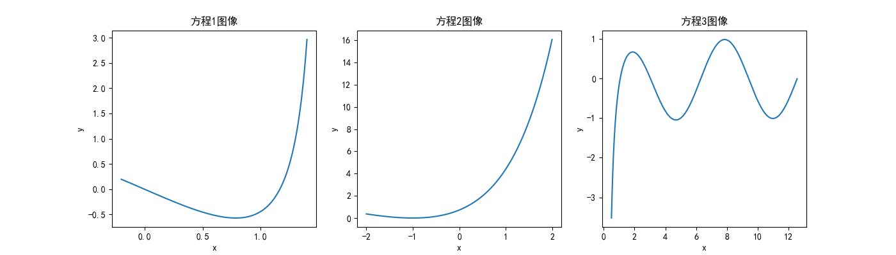

# 期末考试试题：第二部分
23307140040 胡英瀚
## T1

### (1)请为函数find_name_value 拟一个功能描述。
该函数的功能是将一个字符串分割为名字和数值两部分,其中数值以末尾加n表示负数，不加n表示正数。
以下是一些不符合要求情况的特殊处理

- 当该字符串没有数值位时，函数仅返回名字值，而数值返回为空

- 当该字符串末尾的格式不正确，即衔接了一串字符串，那么视作数值为正
### (2)
``` python
import re

def find_name_value(folder_name):
        '''Split the name of a data directory into a (name, value) tuple.

        The format of ``folder_name``:

            <name><value>

        If the value is negative, it should be followed by a 'n'.

        Examples:
            ::

                phi0.1          # should return 'phi', 0.1
                xN14.2          # should return 'xN', 14.2
                kappa0.5n       # should return 'kappa', -0.5

        Args:
            folder_name (str): the name of a :term:`data directory`.

        Returns:
            tuple: a tuple contains:

                * name (str): variable name.
                * value (float): value of the variable.
        '''
        pattern = '([-+]?\d*\.\d+|[-+]?\d+)'
        rst = re.split(pattern, folder_name)
        if len(rst) < 2:
            return folder_name, None
        name = rst[0]
        valuestr = rst[1]
        sign_str = ''
        if len(rst) > 2:
            sign_str = rst[2]
        if sign_str == 'n':
            value = '-' + valuestr
        else:
            value = valuestr

        return name, float(value)

        test = ["abc15", "KFCCRAZYTHURSDAY_VIVO50","int0.55","name1.14n","no_value","signerror404dgserg","test111","abc123def456","name165151","nine9n"]

        for folder_name in test:
            name, value = find_name_value(folder_name)
            if (value != None):
                print("%s -> %s %f" % (folder_name, name, value))
            else:
                print("%s -> %s None" % (folder_name, name))
```
用以上代码来检验函数功能，输出如下：

可见程序功能基本正确，然而在输入为"name-165151n"时则会报错：`ValueError: could not convert string to float: '--165151'`
这是由于代码没有考虑两个负号同时出现的情况导致的，我们将对函数进行修改。
``` python
import re

def find_name_value(folder_name):
        '''Split the name of a data directory into a (name, value) tuple.

        The format of ``folder_name``:

            <name><value>

        If the value is negative, it should be followed by a 'n'.

        Examples:
            ::

                phi0.1          # should return 'phi', 0.1
                xN14.2          # should return 'xN', 14.2
                kappa0.5n       # should return 'kappa', -0.5

        Args:
            folder_name (str): the name of a :term:`data directory`.

        Returns:
            tuple: a tuple contains:

                * name (str): variable name.
                * value (float): value of the variable.
        '''
        pattern = '([-+]?\d*\.\d+|[-+]?\d+)'
        rst = re.split(pattern, folder_name)
        if len(rst) < 2:
            return folder_name, None
        name = rst[0]
        valuestr = rst[1]
        sign_str = ''
        if len(rst) > 2:
            sign_str = rst[2]
        if sign_str == 'n':
            #修改部分
            #---------
            if (valuestr != None):
                if (valuestr[0] != '-'):
                    valuestr = '-' + valuestr
                else:
                    valuestr = valuestr[1:]
            #---------
        value = valuestr

        return name, float(value)
```
这样即可避免问题

### (3)

注：我并不知道该函数原来的目的是否是同时分割多个文件夹名称与值，如果是这样，代码仍需修改


## T2
``` matlab
R = 3;
r = 1;
angle1 = linspace(0, 2*pi, 100);
angle2 = linspace(0, 2*pi, 100);
[angle1, angle2] = meshgrid(angle1, angle2);
x = (R + r * cos(angle1)) .* cos(angle2);
y = (R + r .* cos(angle1)) .* sin(angle2);
z = r * sin(angle1);
surf(x, y, z)
```
得到图像如下所示:


## T3
### (1)


### (2)


## T4
``` markdown
**$Q:$** Find the solution of the following equation with respect to $\theta$:

$Bcos\theta+Bsin\theta +C = 0$

**$A:$**
let $x_1 = cos\theta $ and $x_2 = sin\theta$, then the solution is given by the intersection of the circle and the line:


$$x_1^2 + x_2^2 = 1$$ $$Acos\theta + Bsin\theta + C = 0$$

We reformulate the equations in a parametric form:

$$|x|^2 = 1 $$ $$x(t) = a + tb$$

where $x = (x_1, x_2)$, **$a$**$ = (0, -C/B)$, **$b$**$ = (-C/A, C/B)$, and **$t$** is a parameter. The intersection points satisfy
the following equation:

$$|a + tb|^2 = 1$$

which can be solved for t to find the intersection points:

$$t_{1,2} = \frac{-a \cdot b  \ \pm \ \sqrt{(a \cdot b)^2-|b|^2(|a|^2-1)}}{|b|^2}$$
```
效果如下图所示，PDF文件一并附在提交文件中

由于Markdown无法更改字体，故字体与题设不同，望谅解。
