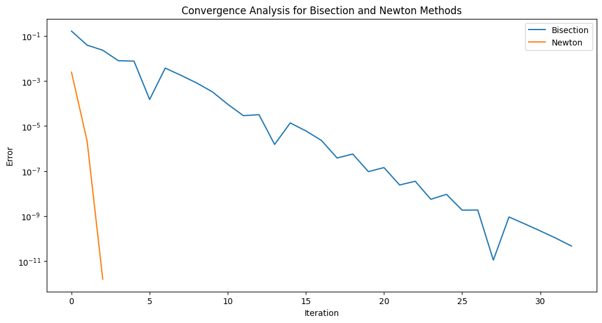

$代码使用方法：直接运行即可\\$

$1. 实现Bisection算法函数\\
i.将区间[a,b]等分为两个⼦区间[a,c]和[c,b]，其中c=(a+b)/2.\\
ii.如果f(a)f(c)<0，则令b=c，否则令a=c.\\
iii.重复上述过程，直到区间⻓度b-a⼩于给定的阈值\varepsilon，即可得到根的近似值.\\$

$2. 实现Newton算法函数\\
i.已知函数f(x)在某个点x_0的函数值f(x_0)及其导数f’(x_0)，令{x_1=x_0-f(x_0)/f’(x_0)}，则x_1为函数f(x)在x_0附近的⼀个根的近似值.\\
ii.利⽤x_1代替x_0重复上述过程，即可得到根的近似值x_2.\\
iii.重复上述过程，即可求得根的近似值x_n.\\
iv.如果前后两个近似根⼩于某个给定的阈值\varepsilon，则认为已经求得根的近似值.\\$

$3. ⽤Numpy/Scipy中的求根函数对以下⽅程进⾏求解，并与上述两种算法的结果进⾏⽐较（⽬标误差设置为\varepsilon=10^{-10} ）：\\
i. 2x=tan(x),x∈[-0.2,1.4].\\
ii. e^{x+1}=2+x,x∈[-2,2].\\
iii. x^{-2}=sin(x),x∈[0.5,4\Pi].（提示： 在这个区间函数有多个根，请⽤合适的画图⽅法先⼤致确认每个根的区间或初始解再逐⼀求解）\\
调用上述两个函数以及scipy.optimize.fsolve()即可$

$4. 误差分析：分别将上述两种算法应⽤于求解{x^2-2=0}在区间(1,2)内的根，⽐较两种算法的收敛速度，并将结果⽤图表形式展示出来.\\
Newton算法收敛速度比Bisection算法快\\$

