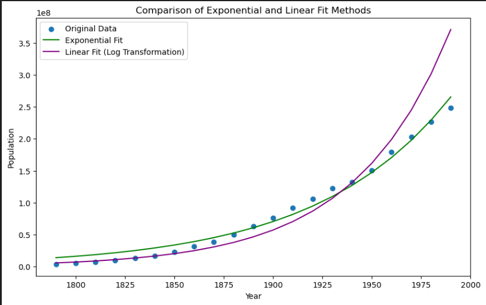

## 一、修改代码，编写测试用例
最终运行结果如下图所示（`A`，`B`的矩阵结果已经包含在`main`代码块当中）：

修改问题如下：
1. 当输入矩阵为空时，需要专门处理
2. 原代码中有除法内容，需要保证除数不为`0`
## 二、Matlab
运行结果：

代码见本文件夹下的文件`finalexam_part2.m`
## 三、mathematic
我利用`WOLFRAM CLOUD`在线网站完成了这个，但是网站上下载下来的文件似乎看起来不太美观（详见本文件夹下`mathematic.nb`文件）
### 1
代码：
~~~
NSum[Cos[Pi/n]/n^3,{n,1,Infinity}]
~~~

无法得到具体的结果，用`NSum`：

### 2
代码：
~~~
NIntegrate[Sin[x]/(x*(E^x+1)),{x,0,Infinity}]
~~~

同样无法得到具体的结果，用`NIntegrate`：

## 四、4.1markdown

# Linear Least Squares

Linear least squares (LLS) is the least squares approximation of linear functions to data. It is a set of formulations for solving statistical problems involved in linear regression，including variants for ordinary (unweighted), weighted, and generalized (correlated) residuals. Numerical methods for linear least squares include inverting the matrix of the normal equations and orthogonal decomposition methods.

##  Basic Formulation

Consider the linear equation
$$
\mathbf{A}\mathbf{x} = \mathbf{b}
$$

where $\mathbf{A}$ $\in$ $\mathbb{R^{m \times n}}$ and $\mathbf{b}$ $\in$ $\mathbb{R^{m}}$ are given and $x$ $\in$ $\mathbb{R^{n}}$ is variable to be computed. When $m > n$, it is generally the case that Eq. (1) has no solution. For example, there is no value of $x$ that satisfies
$$
\begin{bmatrix}
1 & 0 \\
0 & 1 \\
1 & 1
\end{bmatrix}x = \begin{bmatrix}
1 \\
1 \\
0
\end{bmatrix}
$$

because the first two rows require that $x = (1,1)$, but then the third row is not satisfied. Thus, for $m > n$, the goal of solving Eq. (1) exactly is typically replaced by finding the value of $x$ that minimizes some error. There are many ways that the error can be defined, but one of the most common is to define it as $\|\mathbf{A}\mathbf{x} - \mathbf{b}\|^2$. This produces a minimization problem, called a least squares problem
$$
minimize_{x\in\mathbb{R^{n}}}\|\mathbf{A}\mathbf{x} - \mathbf{b}\|^2
$$
The solution to the least squares problem is computed by solving the normal equation
$$
\mathbf{A}^\top \mathbf{A}  \mathbf{x} = \mathbf{A}^\top \mathbf{b}
$$

where $\mathbf{A}^\top$  denotes the transpose of the matrix $\mathbf{A}$.

## 四、4.2预览效果

但在我的电脑当中没有安装latex，也没有配置相关环境，可能渲染的pdf有点不尽如人意。