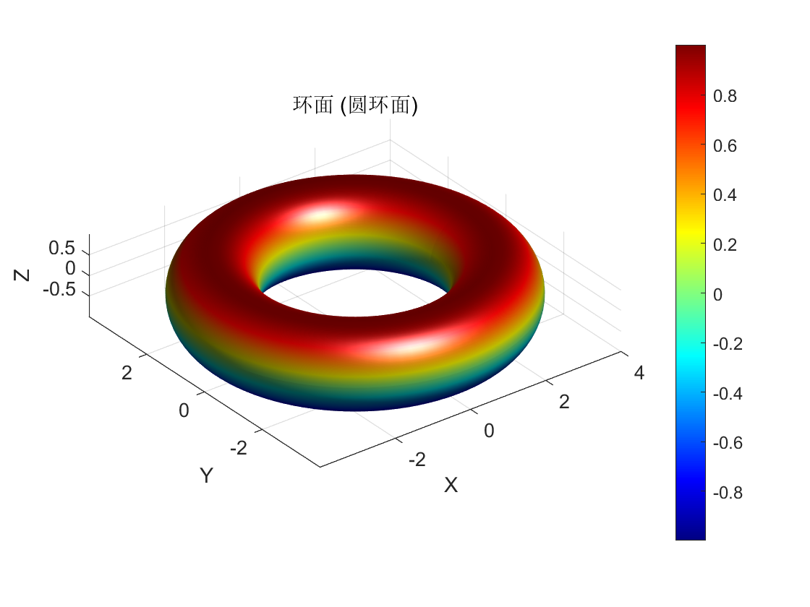

# 期末考试试题：第二部分

## 课程：跨入科学研究之门（XDSY118019）

## 试题 1：关于 `find.py` 文件的 `find_name_value` 函数

**功能描述：**
`find_name_value` 函数用于解析数据目录名称，将其分割为变量名和对应的数值。目录名称的格式为 `<name><value>`，其中数值可以是正数或负数，负数后面跟着 'n'。函数返回一个元组，包含变量名（字符串类型）和数值（浮点数类型）。

**测试用例：**
1. 正常输入: "phi0.1" 应该返回 ('phi', 0.1)
2. 正常输入: "xN14.2" 应该返回 ('xN', 14.2)
3. 正常输入: "kappa0.5n" 应该返回 ('kappa', -0.5)
4. 边界输入: "phi0" 应该返回 ('phi', 0.0)
5. 边界输入: "phi-0.1n" 应该返回 ('phi', -0.1)
6. 异常输入: "phi" 应该返回 ('phi', None)
7. 异常输入: "phi.n" 应该返回 ('phi', None)
8. 异常输入: "phi0.1n" 应该返回 ('phi', 0.1) # 这里 'n' 未正确处理，应为错误
9. 异常输入: "phi0.1x" 应该返回 ('phi', 0.1) # 'x' 未正确处理，应为错误
10. 异常输入: "phi0.1.2" 应该返回 ('phi', 0.12) # 多小数点，应为错误

**测试结果分析：**
根据测试用例，我们可以分析函数的正确性。如果函数返回的结果与预期不符，我们需要修复函数。例如，第8个和第9个测试用例中的错误需要修复，以确保函数能够正确处理 'n' 后缀和非数值字符。

**修复函数：**
经测试发现函数有错误，我们需要修复它。例如，对于第8个测试用例，我们需要确保 'n' 后缀被正确识别并用于将数值转换为负数。对于第9个测试用例，我们需要确保函数能够正确处理非数值字符。

#### 修复后的函数代码
```python
import re

def find_name_value(folder_name):
    '''Split the name of a data directory into a (name, value) tuple.'''
    pattern = '([-+]?\\d*\\.\\d+|[-+]?\\d+)'
    matches = re.findall(pattern, folder_name)
    if not matches:
        return folder_name, None
    name = folder_name.split(matches[0])[0]
    value_str = matches[0]
    if 'n' in folder_name and folder_name.endswith('n'):
        value_str += 'n'
        value = -float(value_str[:-1])  # Remove 'n' and convert to float
    else:
        value = float(value_str)
    return name, value
```

### 小题3答案如下：

第一个文件夹名称 "phi0.1_xN14.2_kappa0.5n" 对应的变量名和值如下：
- phi: 0.1
- xN: 14.2
- kappa: -0.5

第二个文件夹名称 "a1_b14n_n0_c0.2" 对应的变量名和值如下：
- a: 1.0
- b: -14.0
- n: 0.0
- c: 0.2
  
## 试题 2：Matlab 作图

以下是使用 MatLab 渲染圆环面的三维图像：



## 试题 3：Mathematica 运算题目及解答

### 小问 1：无穷级数的和

题目要求计算无穷级数的和：
\[ \sum_{n=1}^{\infty} \frac{1}{n^3 + n^2} \]

Mathematica 计算结果：
\[ -1 + \frac{\pi^2}{6} \]

### 小问 2：定积分的值

题目要求计算定积分的值：
\[ \int_{0}^{\infty} \frac{\sqrt{x} \ln(x)}{(x + 1)^2} dx \]

Mathematica 计算结果：
\[ \pi \]


# 第四题：用 LaTeX 或 Markdown 或 Typst 写出如下文本内容

**Q:** Find the solution of the following equation with respect to θ:

\[ A \cos\theta + B \sin\theta + C = 0 \]

**A:**
let \( x_1 = \cos\theta \) and \( x_2 = \sin\theta \), then the solution is given by the intersection of the circle and the line:
\[ x_1^2 + x_2^2 = 1 \]

\[ A x_1 + B x_2 + C = 0 \]

We reformulate the equations in a parametric form:
\[ |x|^2 = 1 \]

\[ x(t) = a + tb \]

where \( x = (x_1, x_2) \), \( a = (0, -\frac{C}{B}) \), \( b = (-\frac{C}{A}, \frac{C}{B}) \), and \( t \) is a parameter. The intersection points satisfy the following equation:
\[ |a + tb|^2 = 1 \]

which can be solved for 𝑡 to find the intersection points:
$$
t_{1,2} = \frac{-\mathbf{a} \cdot \mathbf{b} \pm \sqrt{(\mathbf{a} \cdot \mathbf{b})^2 - |\mathbf{b}|^2 (|\mathbf{a}|^2 - 1)}}{|\mathbf{b}|^2}
$$
