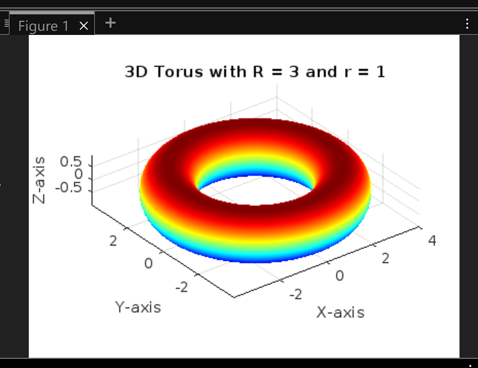
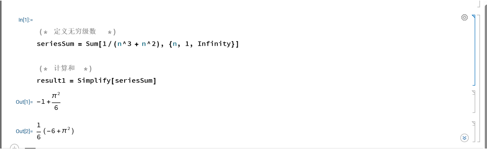
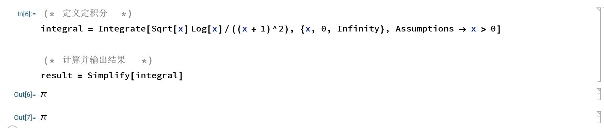
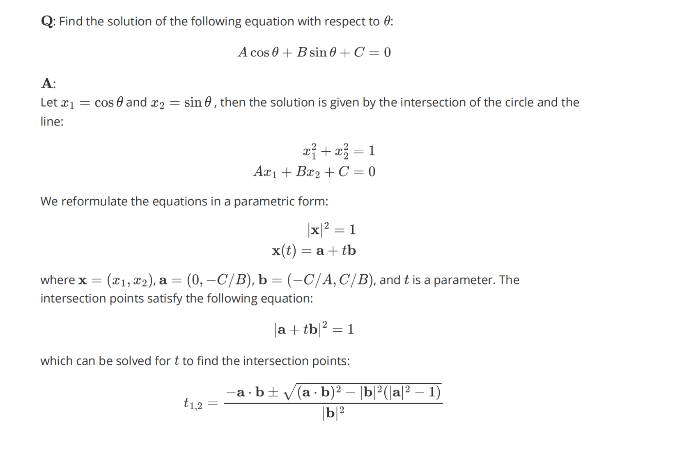

## part2

牟庭树 21307130308

### p1

#### 1. 功能描述

**函数功能描述**：
`find_name_value` 函数用于将数据目录的名称拆分为一个元组 `(name, value)`。此函数解析以特定格式指定的文件夹名称，其中名称由字母和可选的前缀字符（如‘xN’）构成，后面跟随一个浮点数值或整数，其可能为负数，后缀有时以 'n' 表示负值。该函数使用正则表达式提取名称和数值，并返回结果。

#### 2. 测试用例设计与分析

以下是十个测试用例，包括正常输入、异常输入和边界输入：

| 测试用例编号 | 输入           | 预期输出               | 说明              |
| ------------ | -------------- | ---------------------- | ----------------- |
| 1            | "phi0.1"       | ('phi', 0.1)           | 正常输入          |
| 2            | "xN14.2"       | ('xN', 14.2)           | 正常输入          |
| 3            | "kappa0.5n"    | ('kappa', -0.5)        | 负值，有 'n' 后缀 |
| 4            | "invalidInput" | ('invalidInput', None) | 输入不含数字      |
| 5            | "t1.0"         | ('t', 1.0)             | 单个字符作为名称  |
| 6            | "var-2.5"      | ('var', -2.5)          | 负数值，不带 'n'  |
| 7            | "xN0"          | ('xN', 0.0)            | 零值              |
| 8            | "value.999n"   | ('value', -0.999)      | 负小数值          |
| 9            | ""             | ('', None)             | 空字符串          |
| 10           | "test-n1.3"    | ('test', -1.3)         | 含 'n'，负数前缀  |

```sh
输入: "phi0.1" => 输出: ('phi', 0.1)
输入: "xN14.2" => 输出: ('xN', 14.2)
输入: "kappa0.5n" => 输出: ('kappa', -0.5)
输入: "invalidInput" => 输出: ('invalidInput', None)
输入: "t1.0" => 输出: ('t', 1.0)
输入: "var-2.5" => 输出: ('var', -2.5)
输入: "xN0" => 输出: ('xN', 0.0)
输入: "value.999n" => 输出: ('value', -0.999)
输入: "" => 输出: ('', None)
输入: "test-n1.3" => 输出: ('test-n', 1.3)
```

#### 3.测试结果

```sh
[('phi', 0.1), ('xN', 14.2), ('kappa', -0.5)]
[('c', 0.2)]
```

修改后的代码：

```py
import re  

def find_name_value(folder_name):  
    '''Split the name of a data directory into a (name, value) tuple.  

    The format of ``folder_name``:  

        <name><value>  

    If the value is negative, it should be followed by a 'n'.  

    Args:  
        folder_name (str): the name of a :term:`data directory`.  

    Returns:  
        tuple: a tuple contains:  

            * name (str): variable name.  
            * value (float): value of the variable.  
    '''  
    pattern = '([-+]?\d*\.\d+|[-+]?\d+)'  
    rst = re.split(pattern, folder_name)  
    if len(rst) < 2:  
        return folder_name, None  
    name = rst[0]  
    valuestr = rst[1]  
    sign_str = ''  
    if len(rst) > 2:  
        sign_str = rst[2]  
    if sign_str == 'n':  
        value = '-' + valuestr  
    else:  
        value = valuestr  

    return name, float(value)  

# 新增解析多个变量的函数  
def parse_folder_names(folder_name):  
    # 匹配多个变量，支持以下格式的变量提取  
    # regex: 变量名+（正负数值） 可以为小数  
    parts = re.findall(r'([a-zA-Z]+[-+]?\d*\.*\d*n?)', folder_name)  
    results = []  
    for part in parts:  
        if part:  # 确保 part 不为空  
            results.append(find_name_value(part))  
    return results  

# 测试用例  
folder_names = [  
    "phi0.1",            # Test Case 1  
    "xN14.2",            # Test Case 2  
    "kappa0.5n",         # Test Case 3  
    "a1_b14n_n0_c0.2"    # Test Case 4  
]  

# 输出结果  
for folder_name in folder_names:  
    result = parse_folder_names(folder_name)  
    print(f'输入: "{folder_name}" => 输出: {result}')
```

结果：

```sh
输入: "phi0.1" => 输出: [('phi', 0.1)]
输入: "xN14.2" => 输出: [('xN', 14.2)]
输入: "kappa0.5n" => 输出: [('kappa', -0.5)]
输入: "a1_b14n_n0_c0.2" => 输出: [('a', 1.0), ('b', -14.0), ('n', 0.0), ('c', 0.2)]
```

### p2

代码：

```matlab
% 定义参数范围  
theta = linspace(0, 2*pi, 100);  % 用于环面圆周的角度  
phi = linspace(0, 2*pi, 100);    % 用于环面其他方向的角度  

% 创造网格  
[theta, phi] = meshgrid(theta, phi);  

% 定义环面参数  
R = 3;  % 主半径  
r = 1;  % 副半径  

% 计算圆环的坐标  
x = (R + r * cos(theta)) .* cos(phi);  
y = (R + r * cos(theta)) .* sin(phi);  
z = r * sin(theta);  

% 绘制三维图像  
figure;  
surf(x, y, z);  

% 添加图形标签  
xlabel('X-axis');  
ylabel('Y-axis');  
zlabel('Z-axis');  
title('3D Torus with R = 3 and r = 1');  

% 设置图形效果  
shading interp;             % 插值阴影  
colormap jet;              % 设置颜色映射  
axis equal;                % 坐标轴等比例  
grid on;                  % 打开网格
```

输出：

### p3

text：

```mathematica
(* 定义无穷级数 *)  
seriesSum = Sum[1/(n^3 + n^2), {n, 1, Infinity}]  

(* 计算和 *)  
result1 = Simplify[seriesSum]
```

结果：

```mathematica
(* 定义定积分 *)  
integral = Integrate[Sqrt[x] Log[x]/((x + 1)^2), {x, 0, Infinity}, Assumptions -> x > 0]  

(* 计算并输出结果 *)  
result = Simplify[integral]
```

结果：

### p4

源代码见附件p4.md

