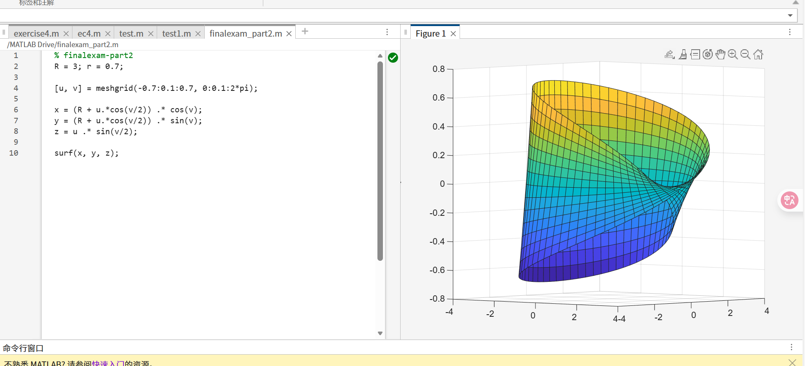
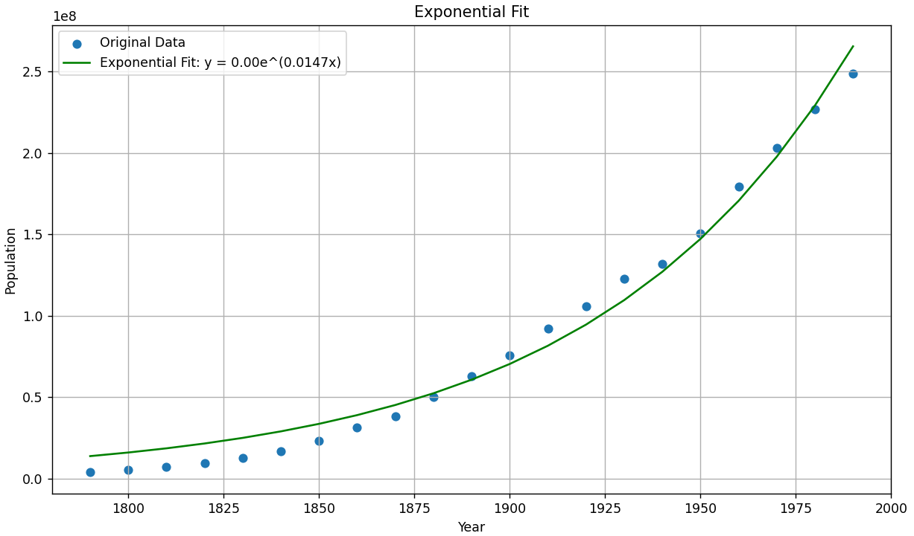
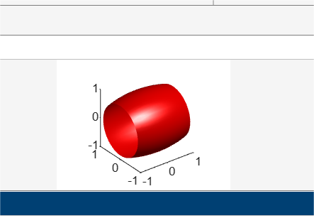
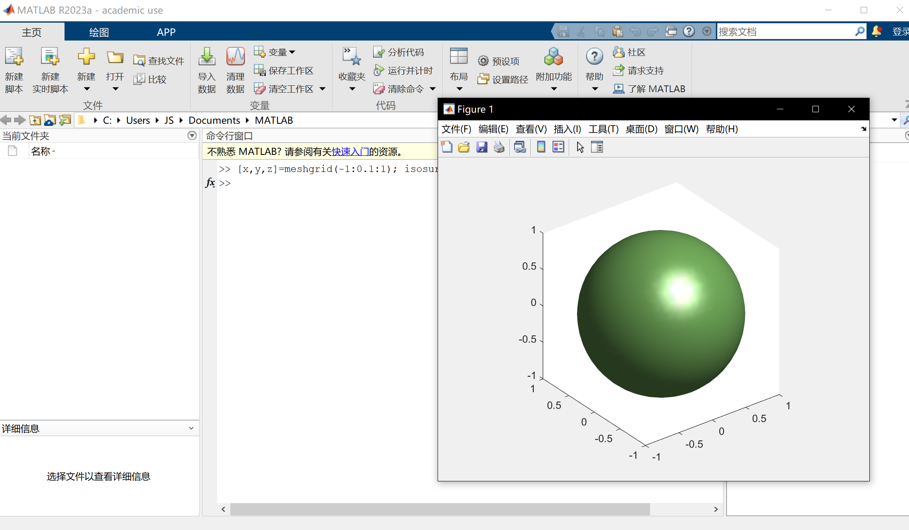
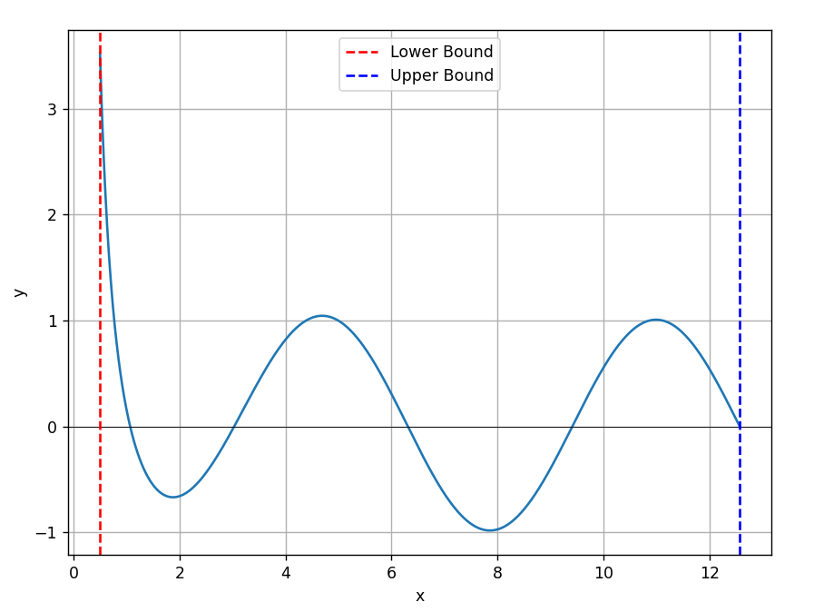
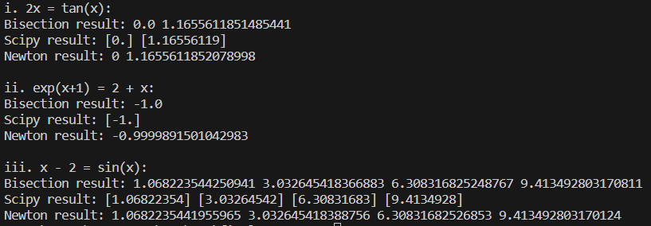
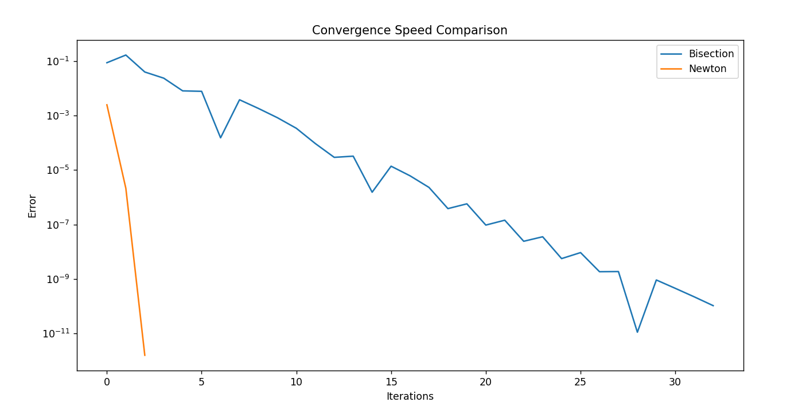
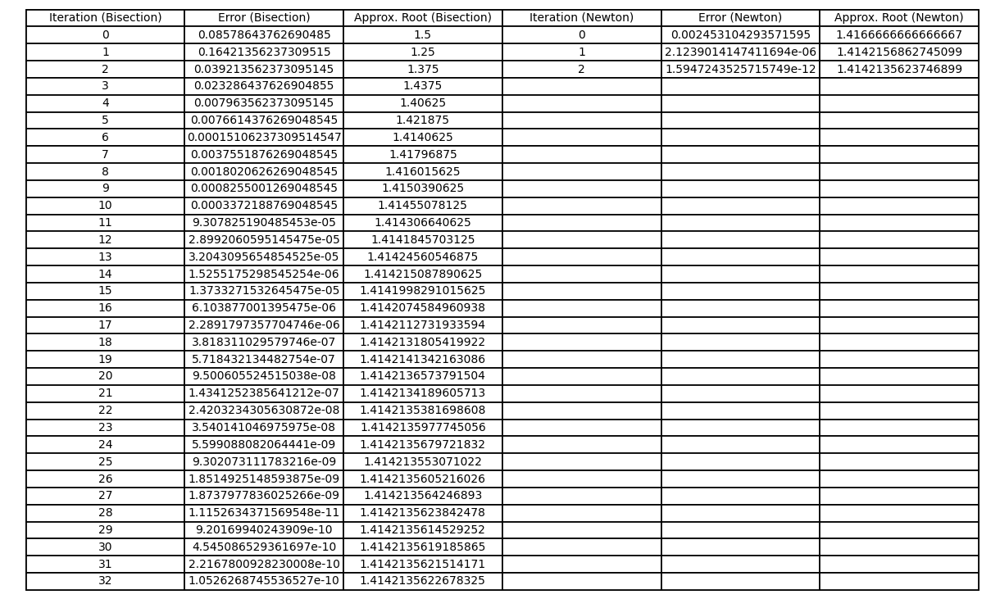

### FinalExamPart1
#### 21307130096 王芃骁
###### Question1
**1. ⼀个Bisection算法函数：输⼊任意函数$f(x)$、包含⼀个根的区间$（a, b）$、⽬标误差$\epsilon$，输出满足条件的近似根**
- 实现思路：将区间[a,b]等分为两个⼦区间[a,c]和[c,b]，然后根据每个子区间的端点处的函数值进行判断这个区间内是否有根。如果乘积值小于等于0，则代表一定有根，然后这样不断二分，直到误差小于阈值。这个方法的前提是需要确定在区间[a,b]上只能有一个根，否则会出现漏根的情况。
- 代码使用说明：在终端中输入需要求解的方程和上下界，注意输入的格式一定需要为标准格式，即可信任的格式。
- 程序示例截图：
    
###### Question2
**2. ⼀个Newton算法函数：输⼊任意函数$f(x)$、导数$df(x)$、根的估计值$x_0$、⽬标误差$\epsilon$，输出满⾜条件的近似根。**
- 实现思路：主要使用了迭代的思想，通过不断求解在$x_0$附近的近似解，并将这个近似解迭代替换成$x_0$，直到最后的两次近似解小于误差阈值。
- 程序示例截图：

###### Question3
**3. 请⽤Numpy/Scipy中的求根函数对以下方程进行求解，并与上述两种算法的结果进行比较（目标误差设置为$\epsilon = 10^{-10}$）：
i. $2x = tan(x), x \in [−0.2, 1.4]$.
ii. $ e^{x+1} = 2 + x, x \in [−2, 2]$.
iii. $ x^−2 = sin(x), x \in [0.5, 4π]$. （提示： 在这个区间函数有多个根，请用合适的画图方法先大致确认每个根的区间或初始解再逐⼀求解）**
- 实现思路：首先使用matploylib库画出三个方程的图像如下：
i.

由图像判断出这个方程的两个根处于[-0.2,0.2]以及[1.0,1.2]两个区间中。
ii.

由图像判断出这个方程有且仅有一个根，为-1。
iii.

由图像判断出这个方程有四个根。
接下来调用自己编写的bisection函数和newton函数对于方程进行求解。
对于使用scipy中的函数进行函数求解，决定使用fsolve函数，fsolve函数的参数要求为函数体以及初始猜测值。fsolve具体实现如下：
    ```
    root1_1_scipy = fsolve(f1,0)
    root1_2_scipy = fsolve(f1,1.1)
    root2_scipy = fsolve(f2,-1)
    root3_1_scipy = fsolve(f3, 0.5)
    root3_2_scipy = fsolve(f3, 3)
    root3_3_scipy = fsolve(f3, 6)
    root3_4_scipy = fsolve(f3, 9)
    ```
    最后将所有的求解结果打印出来进行比较。

- 程序结果截图：

- Scipy中求根函数与自己编写的两种函数求解的比较
    - 在实际运用过程中，fsolve函数的使用更加便捷，需要传入的参数更少，更加方便。这几种方法求解出的结果误差并不大（因为进行了误差控制）

###### Question4
**4. 误差分析：分别将上述两种算法应⽤于求解$x^2 − 2 = 0$在区间$(1, 2)$内的根，⽐较两种算法的收敛速度，并将结果⽤图表形式展示出来。（注：收敛速度即是指根的近似值与真实值之间的误差随迭代次数的变化快慢的趋势）**
- 实现思路：
1. 定义目标函数和导数
2. 调用之前题目中实现的bisection和newton方法。
3. 收敛速度比较： 对两种算法的收敛速度进行比较。在每次迭代中，记录了当前猜测值与真实根的误差，并绘制了以迭代次数为横坐标、误差为纵坐标的图表，使用对数坐标轴以更清晰地显示收敛的速度。
4. 输出最终根： 输出了Bisection算法和Newton算法找到的最终根。
- 程序结果截图
    - 图像显示：
        
    - 表格显示：
        