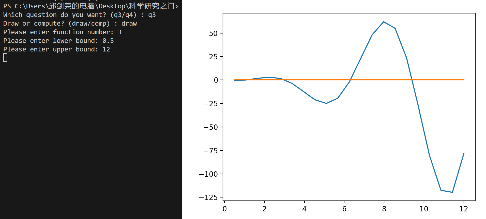
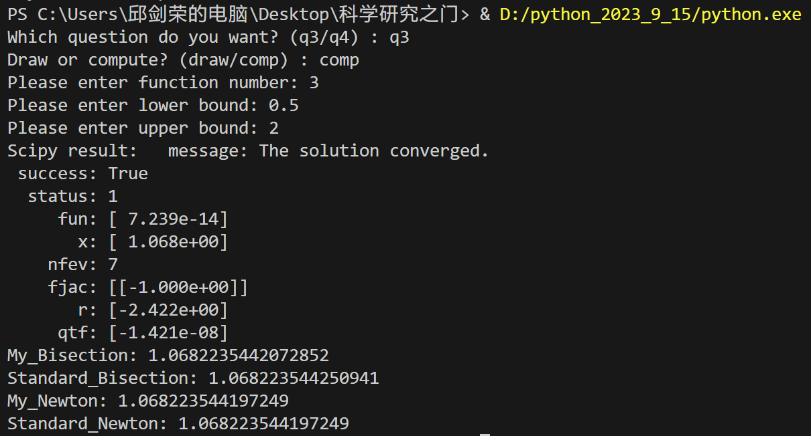
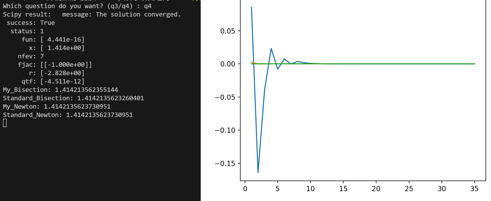

# 使用文档  
## 问题描述  
用Python编写代码以实现：

- 一个Bisection算法函数：输入任意函数 $f(x)$、包含一个根的区间$（a, b）$、目标误差 $\epsilon$ ，输出满足条件的近似根。
- 一个Newton算法函数：输入任意函数 $f(x)$、导数$df(x)$、根的估计值 $x_0$、目标误差$\epsilon$，输出满足条件的近似根。
- 使用 `Numpy/Scipy` 中的求根函数对以下方程进行求解，并与上述两种算法的结果进行比较（目标误差设置为$\epsilon=10^{-10}$）：  
    - $2x = \tan(x), x \in [-0.2, 1.4].$ 
    - $e^{x+1} = 2 + x, x\in[-2,2].$
    - $x^{-2} = \sin(x), x\in[0.5, 4\pi].$ （提示： 在这些区间函数有多个根，请用合适的画图方法先大致确认每个根的区间或初始解再逐一求解）

## 解题思路  
&emsp;&emsp;实际上, 这两种方法都有对应的库函数实现, 不确定能否调包, 所以这里自己实现一版, 并与标准结果进行比较.  
&emsp;&emsp; `bisection()` 采用非递归方法实现, 我们需要动态地改变上下界, 每次区间长度减半, 直到其小于精度限制. 事实上, 使用这种方法要求上下界的函数值异号, 所以第二题实际上是不适用这种方法的.  
&emsp;&emsp; `newton()` 采用递归方法实现, 我们计算每一次 *近似根* 的变化量 `delta`, 若其小于精度要求则得到近似根, 否则将其作为参数传入下一层的递归.  
&emsp;&emsp;值得注意的是, 第4题需要我们记录每一次近似根的偏差, 故上述函数还接收一个模式参数 `mode`, 用它来指示是否需要记录偏差值.   
&emsp;&emsp;主函数这边, 很贴心地设计了用户友好的 `prompt`, 具体使用方法见下一节. 
## 代码使用方法  
&emsp;&emsp;使用方法 `prompt` 都给出了, 只要按照 `prompt` 所写的进行输入即可, 下面是三个使用样例.  

