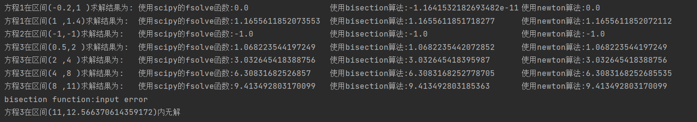
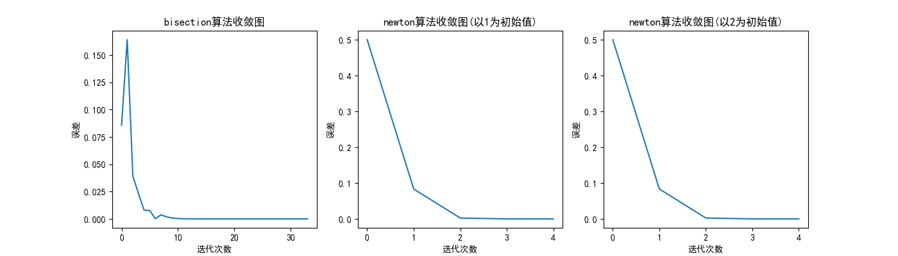

# 代码说明
整个项目包括四个代码文件
## function.py
该文件定义了bisection算法函数和newton算法函数。
## question3.py
该文件用于解答第三题。   
其首先导入了function.py，numpy，scipy库  
然后分别定义了题目中的三个函数及其三个导函数。   
最后定义了一个solve函数，其主要目的是当输入函数及相关参数时，同时打印出三种求解方法的结果进行对比   
由于每个方程在指定区间可能有多个根，所以在求解之前对每个根的区间进行了确定，具体见test.py  
## question4.py
该文件用于解答第四题  
其首先定义了题目函数及其导函数  
后对bisection算法函数和newton算法函数进行了重新定义，主要是多了对误差的存储列表  
最后绘制了两种算法的收敛图。其中由于newton算法要指定初始值，所以分别指定了1和2两个初始值。根据结果发现它们收敛速度完全一样  
## test.py
该文件对第三题中三个函数在指定区间的图像进行了绘制，用于看出每个根的具体区间。  
其中比较特殊的是由图像可以看出第二个方程只有一个根-1，并且函数在x=-1时取得最小值，具体见运行结果。
# 运行结果
## question3.py运行结果

由上可以看出在低精度下三种算法求解结果完全一致，但在高精度下使用fsolve函数和newton算法求解结果更加接近  
## question4.py运行结果

由上可以看出：   
bisection算法迭代次数更大，且在迭代过程中出现振荡的现象。  
newton算法迭代次数远小于bisection算法，并且每次迭代都精准地向真实解逼近    
这说明newton算法更具有科学性和高效性。在实际的例子中，神经网络中的梯度下降算法和newton有类似之处。
## test.py运行结果

由上可以看出:  
方程1第一个根在(-0.2,1)之间，第二个根在(1,1.4)之间  
方程2只有唯一一个根-1，且-1是函数在指定区间的最小值  
方程3第一个根在(0.5,2)之间，第二个根在(2,4)之间，第三个根在(4,8)之间，第四个根在(8,11)之间  
由于在图像中难以看出第三个函数在4π处和0之间的大小关系，所以最后对方程在(11,4π)区间进行求解，结果为无解。