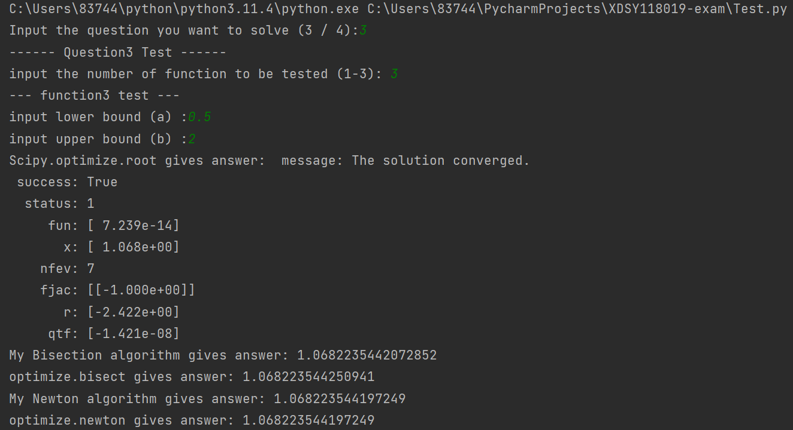
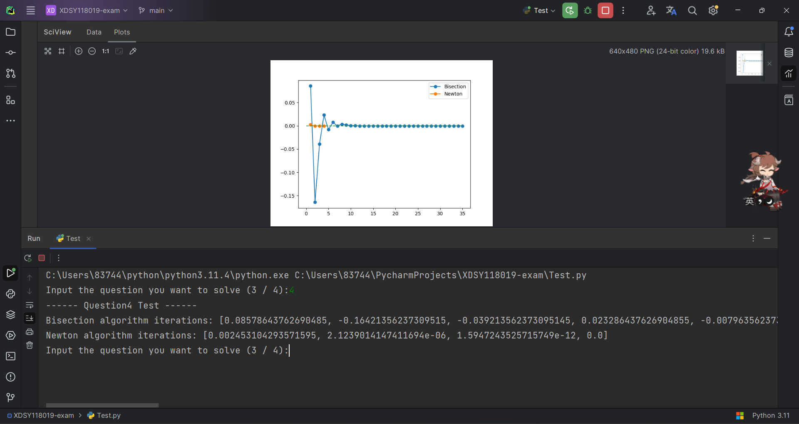

## 关于项目
21307130331 柳睿洋  

&emsp;&emsp;emmm...其实没什么好说的。两个算法按照文档说明实现即可。  
&emsp;&emsp;为了提高复用性，给两个算法的函数设计了一个error参数和一个if_need_error_list参数，用来区分这两个函数是否用于问题4的解答。  
&emsp;&emsp;如果是，那么函数返回一个每次迭代后的误差列表。如果不是，函数返回计算得到的根。  
&emsp;&emsp;关于newton算法，在实现时用到了递归，所以返回的误差列表是一个提前声明的全局变量。  

## 关于使用方法
&emsp;&emsp;运行main函数，根据提示输入即可。  
&emsp;&emsp;注意关于问题3各函数的测试，由于在bisection算法的实现里用到了assert，所以上下界输入值不合适时程序会发出异常并终止，并不是bug。

## 测试案例

