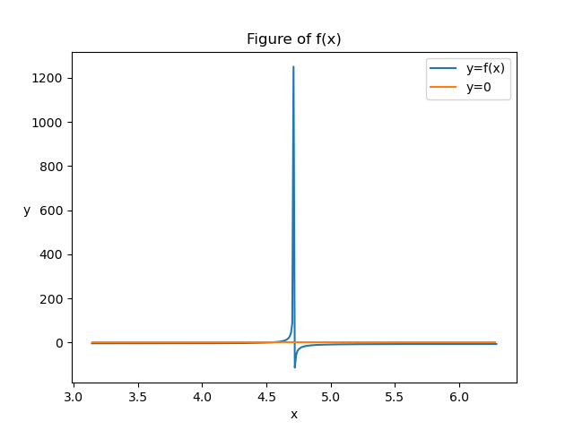
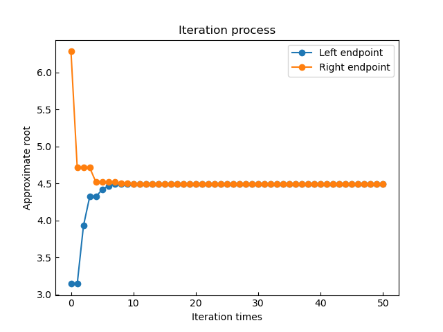

# Root Finding Library([rflib.py](./rflib.py "Created by 黄海洋"))
---
This unified library is for root finding of scalar function and some basic analyses.

## Appliable Method
The method applied currently are as following. Click them for detailed information (**example included**).
- [Bisection](#bisection)
- [Newton](#newton)

## Calls of function

In the beginning of this part of introduction, we have to mention you that we have imported the module `sys` for the constant value `sys.float_info.epsilon` , and in some occasion we have imported the module `matplotlib.pyplot`, `numpy` for plotting, and change the overflow warning to errors to be caught.

We can simply get the use of the lib by import the module `rflib.py`by:
```python
import rflib
```
Then, we can use the public function [root_finding()](#root_finding) and the member function [my_instance.show_process()](#my_instanceshow_process). Click them for detaied information and uses directly.

In the core function `root_finding()`, return is of class `Root`, defined as following:
```python
class Root:
    """
    This is a simple class to store the calls, status of convergence, 
    error, the numerical root and the possible alarm during solving.
    """
    def __init__(self, method : str = None, converged : bool = None,
                 iterations : int = None, root : float = None, 
                 error : float = None, alarm : list = [], process : list = []) -> None:
        # for initialize an instance

    def __str__(self) -> str:
        # for formatting the alarming information and display the `Root`

    def show_process(self, show = False):
        # for showing the procession of solving 
        # function provided in ver 1.1
```
---
And then, we will introduce the two public function :`root_finding()`and the member function `my_instance.show_process()`:

### root_finding()

The core function of this module is **`root_finding()`**, which is defined as following:
```python
def root_finding(f, 
             method : str = None, 
             braket : list = None, 
             fprime = None, 
             x0 = None, 
             x1 = None, 
             epsilon = 100 * float_info.epsilon,
             loop_tol = 1000,
             plot = False,
             plot_interval = None) -> Root:
```

And the return of the function is of class `Root`.

#### Parameters
Meanings and requirements of the parameters are as following:
- **f** : callable
must be a scalar funtion to find root of, or there will raise ValueError

- **method** : str, optional
two given method to choose from:
    - *Bisection* : `bracket` needed, which implies the signum of the endpoints funtion value should be opposite
    - *Newton* :  `fprime`,`x0` needed; `x1` optional.

- **bracket** : list of two element, optional
standing for the begining and the end of a interval(endpoints included)

- **fprime** : callable, optional
the derivative of f

- **x0** : float, optional
the default start value to try in the method of `Newton`

- **x1** : float, optional
the second start value to try in the method of `Newton`

- **epsilon** : float, optional
the shreshold value or the tolerance of the root, default value is 10 times the sys.float_info.epsilon(in code we iterate more to be more precise)

- **loop_tol** : int, optional
the tolerance of the numbers that iterate, default as 1000

- **plot** : bool, optinal
    whether to plot the objective function

- **plot_interval** : list, optional
    the interval to plot on, default as $[-5, 5]$

#### Features

##### Auto-adjusting

The function `root_finding()` together with the inner function `__Bisection` and `__Newton` all have the basic ability of self-adjusting when you didn't point some parameters out:
1. `root_finding()` : 
    - Tell which method you prefer to use 
    - Show the infatal alarms and notices during finding the root
1. `__Bisection` : 
    - Once attemption of the mid value when the value of function at endpoints are of the same sign
1. `__Newton` : 
    - Start with some initial value when not given some parameters that aren't that neccesary
    - Add $\epsilon$ (`sys.float_info.epsilon`) to $f'(x_n)$ when $f'(x_n) = 0$

*P.S.*
The adjusting strategy in `root_finding()` is based on some core parameters:

`braket` for **Bisection** and `fprime` for **Newton**.

When they're all given, the function chooses **Bisection** as default method

##### Ploting available
When there're multiple roots or the stability of Newton method is unsure, the function `root_finding()` is available to plot the objective function on certain interval (optional, default as $[-5, 5]$).

In this function, we use `numpy.arrange()` to arange an array (step set as 0.01) and `matplotlib.pyplot.plot()` to plot the function.

Benefited from the figure, you will have a basic impresion of the objective function, and then find a better interval to start with when using **Bisection** method, optimize the initial value to start with when using **Newton** method, or even change the method to be used.

e.g.
```python
import rflib
import numpy as np

def f(x):
    return np.tan(x) - x

def fprime(x):
    return 1 / (np.cos(x) ** 2) - 1

root = rflib.root_finding(f, "Newton", fprime = fprime, x0 = 5 * np.pi / 4, x1 = 4.5, plot=True, plot_interval=[np.pi, 2 * np.pi])
print(root)
```
Then we can see the basic figure of the function, with trials to find the root:
```
     method : Newton
  converged : True
iterracions : 5
       root : 4.493409457909064
      error : 0.0
      alarm : run time warning : overflow encountered in scalar divide
              First attemption of x_0 = 3.9269908169872414 failed!
              Here comes the second try with the initial value as 4.5
```


---
### my_instance.show_process()
Considering the core uses of the function `root_fingding()` is to provide information of the root, such as the value, error, converged or not and the basic figure if needed. Process of converging isn't among such uses. And for such requirement to demonstrate the converging speed and the converging process in an intuitive manner, we in case develop the member function `show_process()`.

To achieve that, we updated the attributes in the Class `Root`, adding a member `process : list = None` ro record the iteration. However, we didn't change the display of the class (`Root.__str__()`) for the concise purpose. So you should use the member function `show_process()` to demonstrate the figure.

Definition:
```python
# For detailed code please check the sources code.
class Root:
    """"""

    def show_process(self, show = False):
        # for showing the process of solving
        # function provided in version 1.1
        """
        ploting the process of iteration.

        Parameters
        ----------
        show : bool, optional
            determine whether to execute the sentence `plt.show()`, which makes multi-plot being possible
        """
    
    """"""
```

We can simply use it after we have already use the function `root_finding()` and get the value of its return.

e.g.
```python
import rflib
import numpy as np

def f(x):
    return np.tan(x) - x

root = rflib.root_finding(f, "Bisection", [np.pi, 2 * np.pi])
print(root)
root.show_process()
```
With the output as:
```
     method : Bisection
  converged : True
iterracions : 46
       root : 4.493409457909108
      error : 2.220446049250313e-14
      alarm : Given endpoints with same sign! Correcting attempt successed!
```


---
## Introduction of the algorithm

### Bisection

#### ***Introduction***
When tackling the question of root fingding for a objective saclar function, ***Bisection*** is the most famous method to be used.  

We developed the private function `__Bisection()`, the inner function of `root_finding()`, to achieve the algorithm.

#### ***Procedure***
Assuming that there is a *continuous* funtion $f(x)$ on the interval $[a, b]$ s.t. 
$$f(a) \times f(b) \leq 0$$We know that there is at least one root on the interval $[a, b]$, which can be numerically computed with the method ***Bisection*** as following:

1. WOLG, let $f(a) > 0$ and $f(b) < 0$, where we ingnore the case that $a$ or $b$ is the root of $f(x)$.
1. Compute and check the funtion value $f(\frac{a + b}{2})$.
    1. If $f(\frac{a + b}{2}) = 0$, then we actually find a root
    1. If $f(\frac{a + b}{2}) > 0$, then let $a' = \frac{a + b}{2}, b' = b$
    1. If $f(\frac{a + b}{2}) < 0$, then let $a' = a, b' = \frac{a + b}{2}$
1. Instead $[a, b]$ with$[a', b']$ and repeat the step 2. until finding the root or the length of the interval$[a', b'] < \epsilon$, where $\epsilon$ is a given shreshold value of the root.

#### ***Pros & Cons***
- **Pros**
    1. The converging speed is very stable.
    1. The method is applicable in any occasion.
    1. Quite easy to understand.
- **Cons**
    1. We must make sure that the value of the function at the endpoint are of opposite signs.
    1. There might be multiple root on the given interval, whereas we can only find a single one root.
    1. Compared to other method, the converging speed is kind of conservative and is slow.

#### Code example
```python
import numpy as np
import rflib
def f(x):
    return np.exp(x) - 2

root = rflib.root_finding(f, "Bisection", braket=[-1, 1])
print(root)
```
The output is:
```
     method : Bisection
  converged : True
iterracions : 46
       root : 0.6931471805599188
      error : 1.4210854715202004e-14
      alarm : None
```

#### Notice 
- Always return the minimal root when there are multiple roots to return
- Raise error when there're illegal parameters

#### Source definition
```python
# For detailed code please check the sources code.
def __Bisection(f, a = 0, b = 0, epsilon = 100 * float_info.epsilon,
                alarm : list = []) -> Root:
    """
    Finding the root using the method of Bisection

    Parameters
    ----------
    f : callable
        must be a scalar funtion to find root of, or there will raise error when calling

    a : float
        the left endpoint of the interval to find root on

    b : float
        the right endpoint of the interval to find root on

    epsilon : float, optional
        the shreshold value or the tolerance of the root, default value is 10 times the sys.float_info.epsilon

    alarm : str, optional
        the alarm passed by the father function to show in the final result
    
    Returns
    -------
    Return the informations inlcuding the convergence, calls of function, error, and the numertical root
    Notice that the approximate root is the average of the last pair of (a, b),
    which indicate that the error = (b - a) / 2 < epsilon
    """
```

---
### Newton
#### ***Introduction***
For a quicker speed, we can choose the method of ***Newton*** based on the understanding of derivative. 

We developed the private function `__Newton()`, the inner function of `root_finding()`, to achieve the algorithm.

#### ***Procedure***
Assuming that there is a *continuous* and *fitst-order differentiable* funtion $f(x)$.Let the derivative of $f(x)$ be denoted as $f'(x)$.
The numerical computing with the method of ***Newton*** goes as following:

1. Carefully choose an initial value $x_0$ to start with.
1. Draw the tangent line to $f(x)$ at $(x_0, f(x_0))$, which intersects the x-axis at $x_1$. Then $x_1$ is a approximate root of $f(x)$, which can be calculated from the formula:
$$x_{n+1} = x_n - \frac{f(x_n)}{f'(x_n)}$$
1. Repeat the steps above, until the difference between two successive approximate roots($|x_{n + 1} - x_n|$) is lesser than the given shreshold value $\epsilon$

#### ***Pros & Cons***
- **Pros**
1. If the initial value $x_0$ is chosen appropriately, the converging speed is quite impressive.
1. The method of ***Newton*** can also be used in other optimizing question such as solving the minimum and the maximam value of a given function.

- **Cons**
1. The process requires the derivative should exist and does not equals to 0, in order to make the formula $x_{n+1} = x_n - \frac{f(x_n)}{f'(x_n)}$ sensible. Moreover, sometimes the derivative is quite hard to calculate.
1. Convergence is not guaranteed. For some function and initial value $x_0$, the sequece $\{x_n\}$ might not converge, which imply that the method is more suitable for the function that is more slope-mild

#### Code example

```python
import numpy as np
def f(x):
    return x ** 2 - 1

def fprime(x):
    return 2 * x

root = root_finding(f, "Newton", fprime = fprime)
print(root)
```
The output is:
```
     method : Newton
  converged : True
iterracions : 59
       root : 1.0
      error : 0
      alarm : No initial value given! Set as 0!
              Derivative of f equals zero when iterating! Add epsilon!
```
As is should be written as `root_finding(f, "Newton", fprime = fprime, x0 = 1)` (for example), then the output will be:
```
     method : Newton
  converged : True
iterracions : 1
       root : 1
      error : 1.0
      alarm : None
```
Also, we can use two initial value when the solving is easy to be lost in a cycle or there exists some warnings or errors:
```python
import rflib
import numpy as np

def f(x):
    return np.tan(x) - x

def fprime(x):
    return 1 / (np.cos(x) ** 2) - 1

root = rflib.root_finding(f, "Newton", fprime = fprime, x0 = 5 * np.pi / 4, x1 = 4.5)
print(root)
#root.show_process()
```

With the output is:
```
     method : Newton
  converged : True
iterracions : 5
       root : 4.493409457909064
      error : 0.0
      alarm : run time warning : overflow encountered in scalar divide
              First attemption of x_0 = 3.9269908169872414 failed!
              Here comes the second try with the initial value as 4.5
```
P.S. 
The error is 0.0, which means the error is less than`sys.float_info.epsilon`

#### Source definition
```python
# For detailed code please check the sources code.
def __Newton(f, fprime, x0 = None, epsilon = 100 * float_info.epsilon,
              loop_tol = 1000, alarm : list = []) -> Root:
    """
    Finding the root using the method of Bisection

    Parameters
    ----------
    f : callable
        must be a scalar funtion to find root of, or there will raise error when calling

    fprime : callable
        the derivative of f

    x0 : float
        the initial value to start from

    epsilon : float, optional
        the shreshold value or the tolerance of the root, default value is 10 times the sys.float_info.epsilon

    loop_tol : int, optional
        the tolerance of the numbers of loop when iterating, default as 1000 times
    
    alarm : str, optional
        the alarm passed by the father function to show in the final result
    
    Returns
    -------
    Return the informations inlcuding the convergence, calls of function, error, and the numertical root
    Notice that the approximate root is the average of the last pair of (a, b),
    which indicate that the error = (b - a) / 2 < epsilon
    """
```