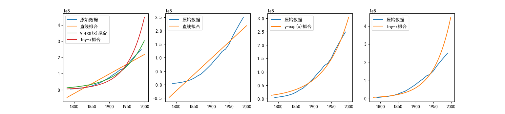
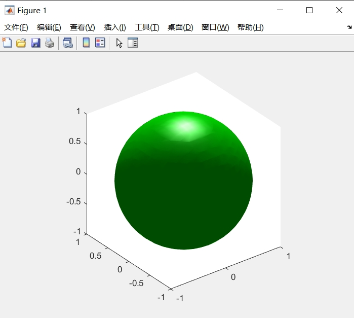
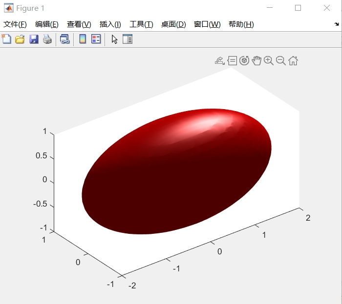

# question1
## 代码
```python
import numpy as np
from scipy.stats import linregress
from scipy.optimize import curve_fit
import matplotlib.pyplot as plt

plt.rcParams["font.sans-serif"] = "SimHei"
plt.rcParams['axes.unicode_minus'] = False

data = np.loadtxt('uspop.txt')
x = data[:, 0]
y = data[:, 1]
result = linregress(x, y)
k, b, r, p, std_err = result


def func1(x, a, c):
    return a * np.exp(c * x)


def func2(x, a, c):
    return c * x + a


params1, _ = curve_fit(func1, x, y, p0=[np.exp(-21.5789), 0.020758])
a1, c1 = params1
params2, _ = curve_fit(func2, x, np.log(y))
a2, c2 = params2

x_ = np.arange(1780, 2000, 1)
y_1 = k * x_ + b
y_2 = func1(x_, a1, c1)
y_3 = np.exp(func2(x_, a2, c2))

plt.figure(figsize=(16, 3.5))
plt.subplot(1, 4, 1)
plt.plot(x, y, label="原始数据")
plt.plot(x_, y_1, label="直线拟合")
plt.plot(x_, y_2, label="y-exp(x)拟合")
plt.plot(x_, y_3, label="lny-x拟合")
plt.legend()

plt.subplot(1, 4, 2)
plt.plot(x, y, label="原始数据")
plt.plot(x_, y_1, label="直线拟合")
plt.legend()

plt.subplot(1, 4, 3)
plt.plot(x, y, label="原始数据")
plt.plot(x_, y_2, label="y-exp(x)拟合")
plt.legend()

plt.subplot(1, 4, 4)
plt.plot(x, y, label="原始数据")
plt.plot(x_, y_3, label="lny-x拟合")
plt.legend()
plt.show()
```
## 运行结果

# question2
## 代码
### 第一小问
```matlab
[x, y, z] = meshgrid(-1:.1:1, -1:.1:1, -1:.1:1);
v = x.^2 + y.^2 + z.^2;
p = isosurface(x, y, z,v,1);
patch(p, 'FaceColor', 'green', 'EdgeColor', 'none');
camlight; lighting gouraud;
view(3); axis equal;
```
### 第二小问
```matlab
[x, y, z] = meshgrid(-2:.1:2, -1:.1:1, -1:.1:1);
v = x.^2./4 + y.^2 + z.^2;
p = isosurface(x, y, z,v,1);
patch(p, 'FaceColor', 'red', 'EdgeColor', 'none');
camlight; lighting gouraud;
view(3); axis equal;
```
## 运行结果
### 第一小问

### 第二小问


# question3
## 代码
Integrate[(Sin[x] - Sin[3*x] + Sin[5*x]) / (Cos[x] + Cos[3*x] + Cos[5*x]), x]
## 运行结果
-Log[Cos[x]] 
# question4
The Lorenz attractor is an <span style="color:blue">attractor</span> that arises in a simplified system of equations describing thetwo-dimensional flow of fluid. ln the early 1960s, Lorenz accidentally discovered the chaoticbehavior of this system when he found that, for a simplified system, periodic solutions of the form
$$\psi =\psi _0\sin \left( \frac{\pi ax}{H} \right) \sin \left( \frac{\pi z}{H} \right)$$
$$\theta =\theta _0\cos \left( \frac{\pi ax}{H} \right) \sin \left( \frac{\pi z}{H} \right)$$
grew for Rayleigh numbers larger than the critical value, $Ra>Ra_c$
. Furthermore, vastly differentresults were obtained for very small changes in the initial values, representing one of the earliestdiscoveries of the so-called <span style="color:blue">butterfly effect</span> .

Lorenz obtained the simplified equations
$$\dot{X}=\sigma \left( Y-X \right)$$
$$\dot{Y}=X\left( \rho -Z \right) -Y$$
$$\dot{Z}=XY-\beta Z$$

now known as the Lorenz equations.