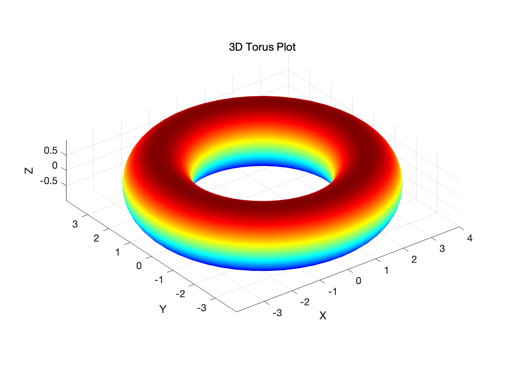

## 期末考试第二部分
### 第一题
#### 1. 功能描述:
将数据目录的名称拆分为 $(name, value)$ 元组的列表。输入字符串的格式为 $<name><value>\_ <name><value>\_...$其中 name 是变量名，value 是变量的数值。如果数值为负数，则应在数值后面跟一个 n。例如，输入字符串 "phi0.1_xN14.2_kappa0.5n" 应返回 [ ('phi', 0.1), ('xN', 14.2), ('kappa', -0.5) ]。函数参数 folder_name 是数据目录的名称，返回值是一个包含多个 (name, value) 元组的列表，每个元组包含变量名和变量的数值。
#### 2. 测试用例：
针对$<name><value>\_ <name><value>\_...$形式的字符串只能输出第一个结果，利用`split('_')`函数拆分，分别针对每个`part`进行变量名和数值的分解，有以下测试用例。

```
# 正常输入
assert find_name_value('phi0.1') == [('phi', 0.1)]
assert find_name_value('xN14.2') == [('xN', 14.2)]
assert find_name_value('kappa0.5n') == [('kappa', -0.5)]
assert find_name_value('alpha-3.14') == [('alpha', -3.14)]
assert find_name_value('beta+2.71') == [('beta', 2.71)]
assert find_name_value('phi0.1_xN14.2') == [('phi', 0.1), ('xN', 14.2)]

# 异常输入
assert find_name_value('gamma') == [('gamma', None)]  # 没有数值部分
assert find_name_value('deltaNaN') == [('deltaNaN', None)]  # 数值部分不是有效数字
assert find_name_value('') == [('', None)]  # 空字符串

# 边界输入
assert find_name_value('epsilon0') == [('epsilon', 0.0)]  # 数值为 0
assert find_name_value('zeta-0.0') == [('zeta', -0.0)]  # 数值为 -0.0
assert find_name_value('eta1234567890') == [('eta', 1234567890.0)]  # 大数值

```
#### 3. 实际运用：
- 输入`phi0.1_xN14.2_kappa0.5n`，应该输出 [('phi', 0.1), ('xN', 14.2), ('kappa', -0.5)]
- 输入`a1_b14n_n0_c0.2`应该输出，[('a', 1.0), ('b', -14.0), ('n', 0.0), ('c', 0.2)]

### 第二题
代码及三维图像如下：
```
% 参数
R = 3;
r = 1;

# 网格分布
theta = linspace(0, 2*pi, 50); % θ 从 0 到 2π
phi = linspace(0, 2*pi, 50);   % ϕ 从 0 到 2π
[theta, phi] = meshgrid(theta, phi);

# 圆环方程
x = (R + r * cos(theta)) .* cos(phi);
y = (R + r * cos(theta)) .* sin(phi);
z = r * sin(theta);

# 绘图
surf(x, y, z);
shading interp; % 平滑颜色
colormap jet;   % 使用 jet 颜色图
axis equal;     % 坐标轴等比例
xlabel('X');
ylabel('Y');
zlabel('Z');
title('3D Torus Plot');
```
<div style="text-align: center;">
    
</div>

### 第三题
代码及答案如下：
```
#求和
Sum[1/(n^3 + n^2), {n, 1, Infinity}]

#定积分
Integrate[Sqrt[x] Log[x]/(x + 1)^2, {x, 0, Infinity}]
```
$\sum_{n=1}^\infty\frac1{n^3+n^2} = -1+\frac{\pi^2}6$  

$\int_0^\infty\frac{\sqrt{x}\ln x}{(x+1)^2}dx = \pi$

### 第四题
**Q:** Find the solution of the following equation with respect to $\theta$:$$
A\cos\theta+B\sin\theta+C=0
$$ **A:**
let $𝑥_1 = \cos\theta$ and $𝑥_2 = \sin\theta$, then the solution is given by the intersection of the circle and the line:
$$x_{1}^{2}+x_{2}^{2} = 1$$ $$A x_{1}+B x_{2}+C = 0$$ We reformulate the equations in a parametric form:$$|\mathbf{x}|^{2}=1$$ $$\mathbf{x}(t)=\mathbf{a}+t \mathbf{b}$$ where $x = (𝑥_1, 𝑥_2)$, $a = (0, −𝐶/𝐵)$, $b = (−𝐶/𝐴, 𝐶/𝐵)$, and $𝑡$ is a parameter. The intersection points satisfy the following equation:$$
|\mathbf{a} + t\mathbf{b}|^2 = 1
$$ which can be solved for 𝑡 to find the intersection points:$$
t_{1,2} = \frac{-\mathbf{a} \cdot \mathbf{b} \pm \sqrt{(\mathbf{a} \cdot \mathbf{b})^2 - |\mathbf{b}|^2 \left(|\mathbf{a}|^2 - 1\right)}}{|\mathbf{b}|^2}
$$


