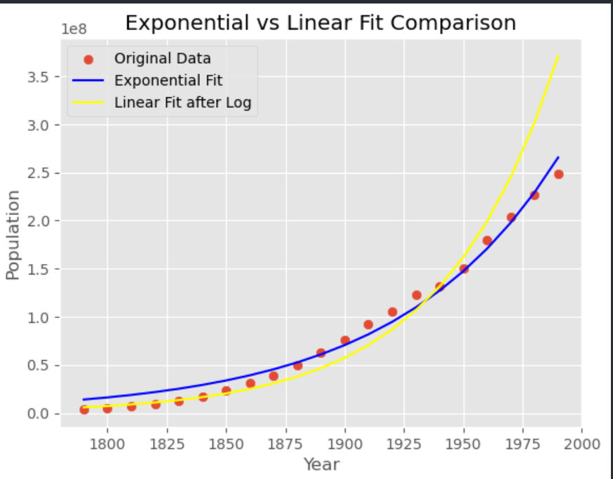

# Final

> **21307130013 黄子骕**
> 

# 第一题

## i

```python
data = np.loadtxt('uspop.txt')
x, y = data[:, 0], data[:, 1]
```

## ii

```python
m, b, r2, p, se = linregress(x, y)  
plt.plot(x, m*x + b, label='Linear Fit', color='red') 
plt.scatter(x, y, label='Original Data')
plt.legend(loc='upper right')
plt.xlabel('Year')  
plt.ylabel('Population')
plt.title('Population Growth Trend') 
plt.show()
```


## iii

```python
def exp_func(x, a, c):
  return a * np.exp(c * x)

x_scaled = x / 1000
y_scaled = y / 1e6

opt_params, cov_params = curve_fit(exp_func, x_scaled, y_scaled) 

a_scaled, c_scaled = opt_params
a = a_scaled * 1e6  
c = c_scaled / 1000

y_fit = exp_func(x, a, c)

plt.plot(x, y_fit, label='Fitted Curve', color='purple')  
plt.scatter(x, y, label='Original Data')
plt.legend(loc='upper right')
plt.xlabel('Year')
plt.ylabel('Value') 
plt.title('Exponential Data Fitting')
plt.show()
```


## iiii

```python
log_y = np.log(y)  
m, b, r2, p, se = linregress(x, log_y)  
y_linear_fit = np.exp(b) * np.exp(m * x)
y_exp_fit = a * np.exp(c * x)  

plt.plot(x, y_exp_fit, label='Exponential Fit', color='green')
plt.plot(x, y_linear_fit, label='Linear Fit after Log', color='purple') 
plt.scatter(x, y, label='Original Data', color='blue')
plt.legend(loc='upper right')  
plt.xlabel('Year')
plt.ylabel('Value')
plt.title('Exponential vs Linear Fit Comparison') 

plt.show()
```



# 第二题

## i

```matlab
[x,y,z]=meshgrid(-1:0.1:1);
isosurface(x,y,z,x.^2+y.^2+z.^2-1,0); 
axis equal;
colormap summer
```


## ii

```matlab
[x, y, z] = meshgrid(-2:0.1:2, -1.5:0.1:1.5, -1:0.1:1);
a = 2;
b = 1;
V = (x.^2/a^2 + y.^2/b^2 + z.^2/b^2);
isosurface(x, y, z, V, 1);
axis equal;
colormap([1 0 0]);
```


# 第三题

```mathematica
Input:
Integrate[(Sin[x] - Sin[3*x] + Sin[5*x])/(Cos[x] + Cos[3*x] + Cos[5*x]),x]
Output:
-Log(Cos[x])
```


# 第四题

# Lorenz Attractor

The Lorenz attractor is an [attractor](https://mathworld.wolfram.com/Attractor.html) that arises in a simplified system of equations describing the two-dimensional flow of fluid. In the early 1960s, Lorenz accidentally discovered the chaotic behavior of this system when he found that, for a simplified system, periodic solutions of the form

$$\psi = \psi_0 \sin\left(\frac{\pi ax}{H}\right)\sin\left(\frac{\pi z}{H}\right)$$

$$\theta = \theta_0 \cos\left(\frac{\pi ax}{H}\right)\sin\left(\frac{\pi z}{H}\right)$$

grew for Rayleigh numbers larger than the critical value, $Ra>Ra_c$. Furthermore, vastly different results were obtained for very small changes in the initial values, representing one of the earliest discoveries of the so-called [butterfly effect](https://mathworld.wolfram.com/ButterflyEffect.html).

Lorenz obtained the simplified equations

$$\dot{X} = \sigma(Y-X)$$

$$\dot{Y} = X(\rho-Z)-Y$$

$$\dot{Z} = XY-\beta Z$$

now known as the Lorenz equations.