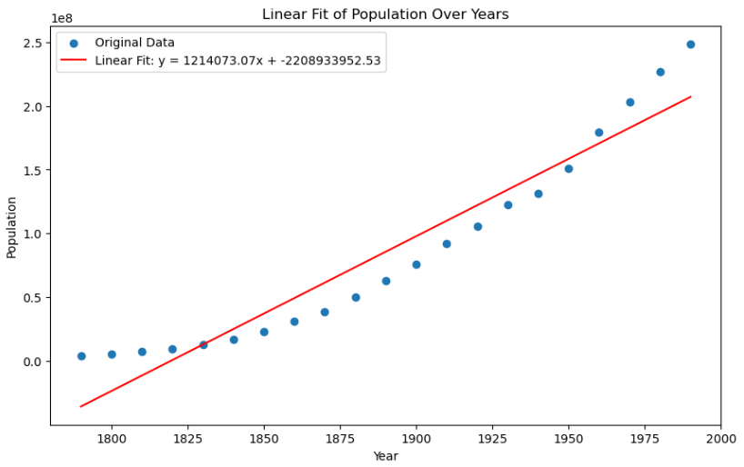
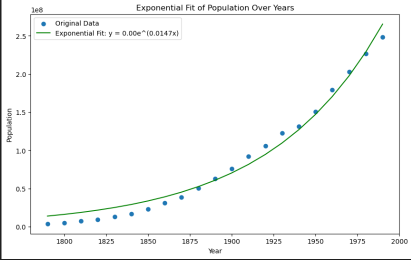
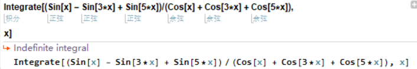

# Final Exam
尚宇 21307130233

## 人口数据拟合
1. 请用numpy.loadtxt函数读入数据，将年份和对应的人口数分别存入x和y两个变量中。
    ```python
    import numpy as np
    import matplotlib.pyplot as plt
    from scipy.stats import linregress
    from scipy.optimize import curve_fit
    
    data = np.loadtxt('uspop.txt')
    x, y = data[:, 0], data[:, 1]
    ```
2. 请用线性拟合函数scipy.stats.linregress拟合人口数随年份变化的曲线，拟合函数为$y=kx+b$，其中$k,b$为拟合参数。并将拟合结果及原始数据用matplotlib.pyplot.plot函数画在同一张图中。
    ```python
    slope, intercept, r_value, p_value, std_err = linregress(x, y)
    linear_fit = slope * x + intercept
    
    plt.figure(figsize=(10, 6))
    plt.scatter(x, y, label='Original Data')
    plt.plot(x, linear_fit, label=f'Linear Fit: y = {slope:.2f}x + {intercept:.2f}', color='red')
    plt.xlabel('Year')
    plt.ylabel('Population')
    plt.legend()
    plt.title('Linear Fit of Population Over Years')
    plt.show()
    ```
    运行结果：
    

3. 请用scipy.optimize.curve_fit函数拟合人口数随年份变化的曲线，拟合函数为$y=ae^{cx}$，其中$a,c$为拟合参数。并将拟合结果及原始数据用matplotlib.pyplot.plot函数画在同一张图中。
    ```python
    def exponential_fit(x, a, c):
    return a * np.expm1(c * x)
    
    x_normalized = x / 1000.0  
    y_normalized = y / 1e6    
    
    popt_normalized, pcov_normalized = curve_fit(exponential_fit, x_normalized, y_normalized)
    
    a_normalized, c_normalized = popt_normalized
    a = a_normalized * 1e6  
    c = c_normalized / 1000.0  
    
    exponential_fit_values = exponential_fit(x, a, c)
    
    plt.figure(figsize=(10, 6))
    plt.scatter(x, y, label='Original Data')
    plt.plot(x, exponential_fit_values, label=f'Exponential Fit: y = {a:.2f}e^({c:.4f}x)', color='green')
    plt.xlabel('Year')
    plt.ylabel('Population')
    plt.legend()
    plt.title('Exponential Fit of Population Over Years')
    plt.show()
    ```
    运行结果：
    

4. 将上一小题中的曲线拟合问题通过公式变换转为线性拟合问题重新拟合。试比较这两种拟合方法的结果是否一致。
    ```python
    log_y = np.log(y)
    slope_log, intercept_log, r_value_log, p_value_log, std_err_log = linregress(x, log_y)
    exponential_fit_linear_transform = np.exp(intercept_log) * np.exp(slope_log * x)
    
    plt.figure(figsize=(10, 6))
    plt.scatter(x, y, label='Original Data')
    plt.plot(x, exponential_fit_values, label='Exponential Fit', color='green')
    plt.plot(x, exponential_fit_linear_transform, label='Linear Fit (Log Transformation)', color='purple')
    plt.xlabel('Year')
    plt.ylabel('Population')
    plt.legend()
    plt.title('Comparison of Exponential and Linear Fit Methods')
    plt.show()
    ```
    运行结果：
    
    这两种拟合方式得到的结果不完全相同。

## Matlab作图
1. 一个半径为1的球面，球面为绿色。

2. 一个长轴为2，短轴为1的椭球面，其中椭球面由椭圆绕长轴旋转得到，椭球面为红色。


## Mathematica求不定积分

Input:
Integrate[(Sin[x] - Sin[3*x] + Sin[5*x])/(Cos[x] + Cos[3*x] + Cos[5*x]),x]
Output:
-Log(Cos[x])


## Markdown

# Lorenz Attractor

The Lorenz attractor is an [attractor](https://mathworld.wolfram.com/Attractor.html) that arises in a simplified system of equations describing the two-dimensional flow of fluid. In the early 1960s, Lorenz accidentally discovered the chaotic behavior of this system when he found that, for a simplified system, periodic solutions of the form

$$
\psi = \psi_0 \sin\left(\frac{\pi ax}{H}\right)\sin\left(\frac{\pi z}{H}\right) \\
\theta = \theta_0 \cos\left(\frac{\pi ax}{H}\right)\sin\left(\frac{\pi z}{H}\right)
$$

grew for Rayleigh numbers larger than the critical value, $Ra>Ra_c$. Furthermore, vastly different results were obtained for very small changes in the initial values, representing one of the earliest discoveries of the so-called [butterfly effect](https://mathworld.wolfram.com/ButterflyEffect.html).

Lorenz obtained the simplified equations

$$
\dot{X} = \sigma(Y-X) \\
\dot{Y} = X(\rho-Z)-Y \\
\dot{Z} = XY-\beta Z \\
$$

now known as the Lorenz equations.