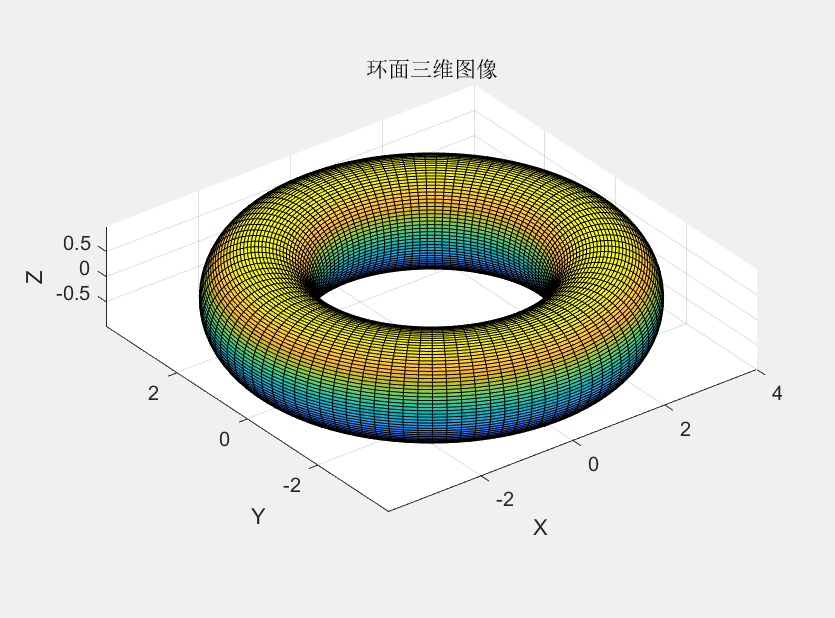
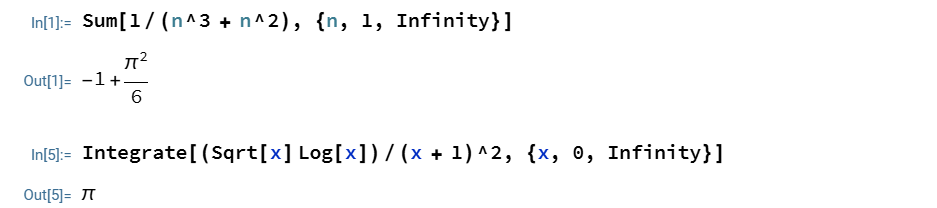
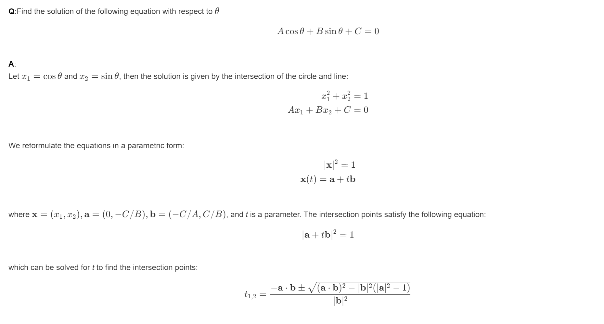

## 1 python
1. 这个函数用于将一个特定格式的字符串分割成字符和数字部分，并分别储存。对该字符串的格式要求是`<name><value>`，如果数字部分是负数，则应在字符串后加上'n'，即可在数字部分得到负数。
2. ||input|output|
   |-|-----|------|
   |1|phi0.1|'phi',0.1|
   |2|kappa0.5n|'kappa',-0.5|
   |3|123|'',123.0|
   |4|abc|'abc',None|
   |5||'',None|
   |6|++--0.1|'++-',-0.1|
   |7|++--0.1n|/|
   |8|a1b2c3|'a',1|
   |9|%^&*().1|'%^&*()',0.1|
   |10|++--0.00|'++-',-0.0|

   我们在第6，7，9，10组测试数据发现了异常，第6组的`-`应当读入字符部分而不是数字部分，第7组报错，第9组`.`应当读入字符部分而不是数字部分，第10组`-0.0`不合理。
   这应该是程序第28行的正则表达式不合理，负数的判断应该由最后是否有`n`决定，而不应作为数字的一部分被读取。
   我们将其改为`pattern =  '(\d+\.\d+|\d+)'`即可得到正确的结果。(取消将正负号读入数字部分；将`\d*`改为`\d+`避免字符部分最后的`.`被读入数字部分。)
3. 'phi',0.1    'xN',14.2    'kappa',-0.5
   'a',1.0    'b',-14.0    'n',0.0    'c',0.2
## 2 matlab
```
R = 3;
r = 1;
% 创建角度向量
theta = linspace(0, 2*pi, 100);
phi = linspace(0, 2*pi, 100);
[Theta, Phi] = meshgrid(theta, phi);
% 计算x, y, z的值
X = (R + r*cos(Theta)) .* cos(Phi);
Y = (R + r*cos(Theta)) .* sin(Phi);
Z = r * sin(Theta);
% 绘制三维图像
surf(X, Y, Z);
xlabel('X');
ylabel('Y');
zlabel('Z');
title('环面三维图像');
axis equal;
```
图像如下：

## 3 mathmatica
```
Sum[1/(n^3 + n^2), {n, 1, Infinity}]
Integrate[(Sqrt[x] Log[x])/(x + 1)^2, {x, 0, Infinity}]
```
结果如下：

## 4 markdown
```
**Q**:Find the solution of the following equation with respect to $\theta$
$$
A\cos\theta+B\sin\theta+C=0
$$
**A**:
Let $x_1=\cos\theta$ and $x_2=\sin\theta$, then the solution is given by the intersection of the circle and line:
$$
\begin{align*}
x_1^2+x_2^2=1\\
Ax_1+Bx_2+C=0
\end{align*}
$$
We reformulate the equations in a parametric form:
$$
\begin{align*}
|\mathbf{x}|^2=1&\\
\mathbf{x}(t)=\mathbf{a}+t\mathbf{b}&
\end{align*}
$$
where $\mathbf{x}=(x_1,x_2),\mathbf{a}=(0,-C/B),\mathbf{b}=(-C/A,C/B)$, and *t* is a parameter. The intersection points satisfy the following equation:
$$
|\mathbf{a}+t\mathbf{b}|^2=1
$$
which can be solved for *t* to find the intersection points:
$$
t_{1,2} = \frac{-\mathbf{a} \cdot \mathbf{b} \pm \sqrt{(\mathbf{a} \cdot \mathbf{b})^2 - |\mathbf{b}|^2 (|\mathbf{a}|^2 - 1)}}{|\mathbf{b}|^2}
$$
```
效果图如下：
