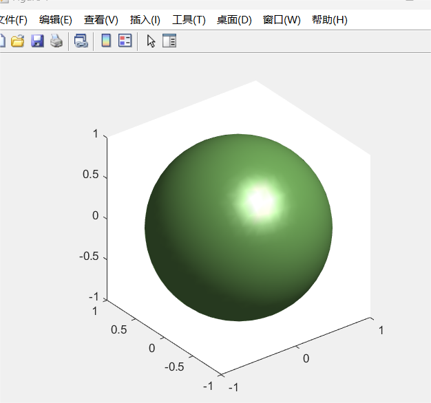
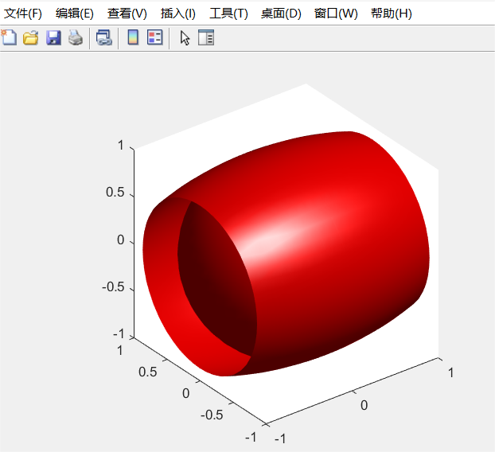

## 这是第二题matlab的代码
1. [x,y,z]=meshgrid(-1:0.1:1); isosurface(x,y,z,x.^2+y.^2+z.^2-1,0); axis equal; colormap summer  

2. [x,y,z] = meshgrid(-1:0.1:1,-1:0.1:1,-1:0.1:1); a = 2; b = 1; V = (x.^2/a^2 + y.^2/b^2 + z.^2/b^2); isosurface(x,y,z,V,1); axis equal; colormap([1 0 0])  

