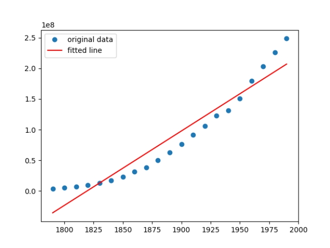
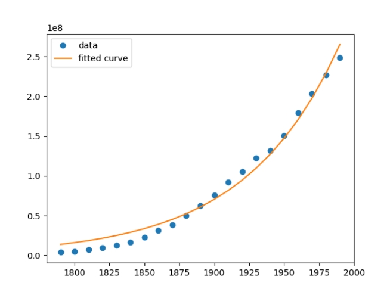
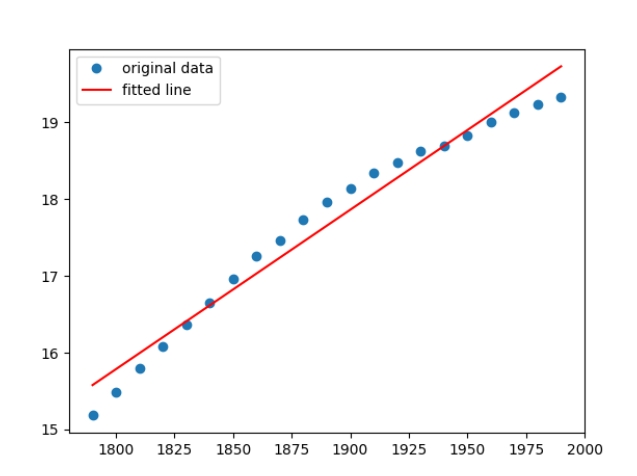
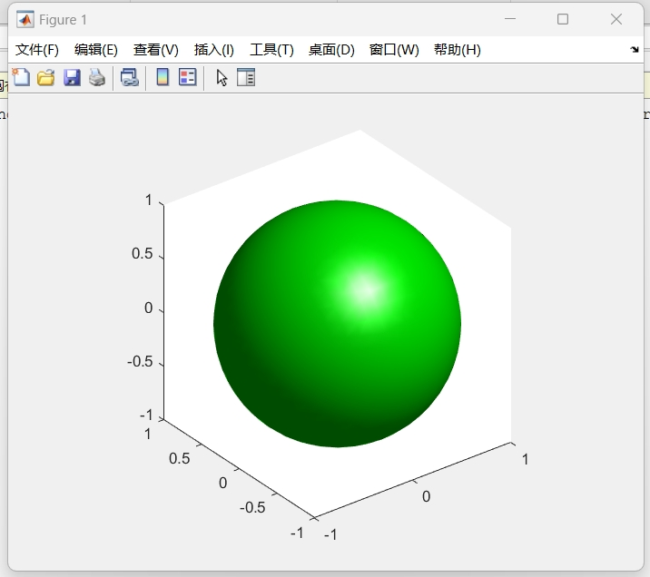
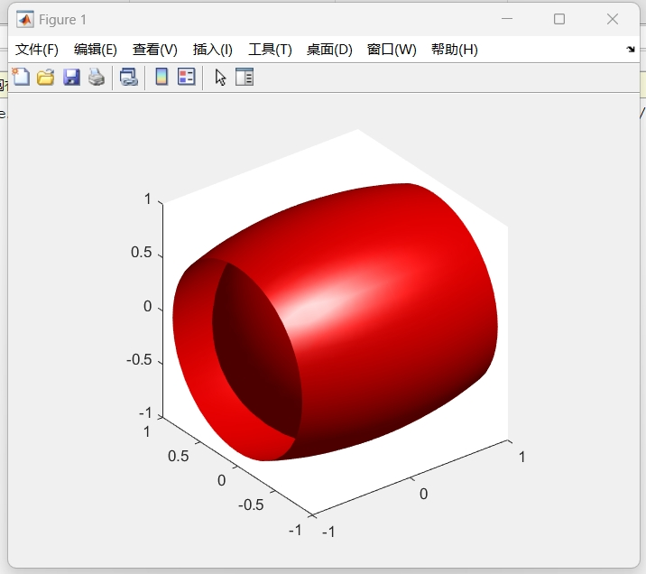
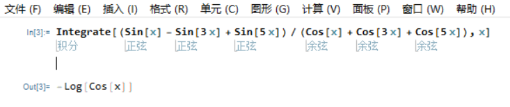

# 期末考试
21307130331 柳睿洋

## 第一题
```python
import numpy as np
from scipy import *
import matplotlib.pyplot as plt

# 第一题
x, y = np.loadtxt('uspop.txt', delimiter=' ', usecols=(0, 1), unpack=True)

# 第二题
def linregeress(x, y):
    res = stats.linregress(x, y)

    def fun(x):  # 拟合后的线性函数
        return res.intercept + res.slope * x

    plt.plot(x, y, 'o', label='original data')  # 原数据标点
    plt.plot(x, fun(x), 'r', label='fitted line')  # 拟合直线
    plt.legend()
    plt.show()

linregeress(x, y)  # 第二题调试

# 第三题
def curve_fit(xdata, ydata):
    def func(x, a, c):
        return a * np.exp(c * x)
    
    popt = optimize.curve_fit(func, xdata, ydata, bounds=(-10, 10))  # 拟合方程，参数包括func，xdata，ydata，
    # plot出拟合曲线，其中的y使用拟合方程和xdata求出

    plt.plot(xdata, ydata, 'o', label='data')
    plt.plot(xdata, func(xdata, popt[0][0], popt[0][1]), label='fitted curve')
    plt.legend()
    plt.show()

curve_fit(x, y)

# 第四题
# 取自然对数即得到近似线性关系
linregeress(x, np.log(y))
```
测试结果：




## 第二题
```matlab
% 第一题
[x,y,z]=meshgrid(-1:0.1:1); isosurface(x,y,z,x.^2+y.^2+z.^2-1,0); axis equal; colormap ([0 1 0])

% 第二题
[x,y,z] = meshgrid(-1:0.1:1,-1:0.1:1,-1:0.1:1); a = 2; b = 1; V = (x.^2/a^2 + y.^2/b^2 + z.^2/b^2); isosurface(x,y,z,V,1); axis equal; colormap([1 0 0])
```
测试结果：



## 第三题
```
Integrate[(Sin[x] - Sin[3 x] + Sin[5 x])/(Cos[x] + Cos[3 x] + Cos[5 x]), x]
```
测试结果：


## 第四题
# Lorenz Attractor
The Lorenz attractor is an [attractor](https://mathworld.wolfram.com/Attractor.html) that arises in a simplified system of equations describing the two-dimensional flow of fluid. In the early 1960s, Lorenz accidentally discovered the chaotic behavior of this system when he found that, for a simplified system, periodic solutions of the form
$$\begin{array}{c}
{{\psi=\psi_{0}\sin\left(\frac{\pi a x}{H}\right)\sin\left(\frac{\pi z}{H}\right)}}
\\\\
{{\theta=\theta_{0}\cos\left(\frac{\pi a x}{H}\right)\sin\left(\frac{\pi z}{H}\right)}}
\end{array}$$
grew for Rayleigh numbers larger than the critical value, $Ra>Ra_c$. Furthermore, vastly different results were obtained for very small changes in the initial values, representing one of the earliest discoveries of the so-called [butterfly effect](https://mathworld.wolfram.com/ButterflyEffect.html).

Lorenz obtained the simplified equations
$$\dot{X}=\sigma(Y-X)
\\\\\\
\dot{Y}=X(\rho-Z)-Y
\\\\\\
\dot{Z}=X Y-\beta Z$$
now known as the Lorenz equations.
