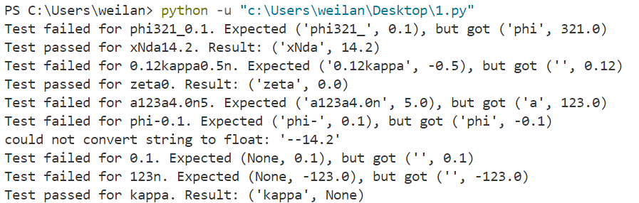
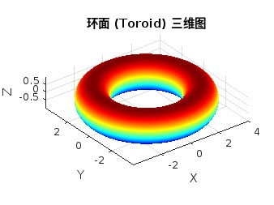

# part2

## 1.1 功能描述：

`find_name_value` 函数将一个包含变量名称和数值的目录名（字符串）解析为一个 `(name, value)` 的元组。这个函数能够识别数值是否为负，并相应地处理数值的符号。

### 输入：

- **folder_name**（字符串）：表示数据目录名称，格式为 `<name><value>`，其中：
    - `<name>` 是字母和数字的组合，表示变量名。
    - `<value>` 是与变量名相关联的数值。如果数值为负，格式会在数值后面加上字母 `'n'`，表示负数值。

### 输出：

- 返回一个元组 `(name, value)`，其中：
    - `name` 是字符串，表示变量的名称。
    - `value` 是浮动类型，表示与该名称相关联的数值。如果目录名包含 `n`，则表示该数值为负数。

### 说明：

- 数值部分可以是整数或浮动数字。
- 如果目录名中的数值带有 `'n'`，表示该数值是负的。

### 用途：

该函数适用于解析某些数据目录名称，自动提取并转换名称和数值部分，方便进一步的数据处理。

## 1.2 修复

### 测试代码

```python
def test_find_name_value():
    test_cases = [
        ('phi321_0.1', ('phi321_', 0.1)), # name含数字
        ('xNda14.2', ('xNda', 14.2)), # 正常输入
        ('0.12kappa0.5n', ('0.12kappa', -0.5)), # name含数字
        ('zeta0', ('zeta', 0.0)), # 边界：值为0
        ('a123a4.0n5', ('a123a4.0n', 5.0)), # name含数字
        ('phi-0.1', ('phi-', 0.1)), # 边界：负数
        ('xN-14.2n', ('xN-', -14.2)), # 边界：负数
        ('0.1', (None, 0.1)), # 异常：无name
        ('123n', (None, -123.0)), # 异常：无name
        ('kappa', ('kappa', None)), # 异常：无value
    ]
    
    for folder_name, expected in test_cases:
        try:
            result = find_name_value(folder_name)
            assert result == expected, f"Test failed for {folder_name}. Expected {expected}, but got {result}"
            print(f"Test passed for {folder_name}. Result: {result}")
        except Exception as e:
            print(e)

test_find_name_value()
```

### 原始代码运行结果



可以看到需要修改的部分包括：

- 对下划线的处理
- name中含有数字的情况
- 正负由于由末尾的n来表示所以正负号应被视为包含在name中
- name为空的情况

### 修改后函数

```python
def find_name_value(folder_name):
    '''Split the name of a data directory into a (name, value) tuple.

    The format of ``folder_name``:

        <name><value>

    If the value is negative, it should be followed by a 'n'.

    Examples:
        ::

            phi0.1          # should return 'phi', 0.1
            xN14.2          # should return 'xN', 14.2
            kappa0.5n       # should return 'kappa', -0.5
            phi-0.1n        # should return 'phi', -0.1

    Args:
        folder_name (str): the name of a :term:`data directory`.

    Returns:
        tuple: a tuple contains:

            * name (str): variable name.
            * value (float): value of the variable.
    '''
    pattern = r'(\d*\.\d+|\d+)(n?)$'
    match = re.search(pattern, folder_name)
    if not match:
        return folder_name, None
    
    value_str, sign_str = match.groups()
    name = folder_name[:match.start()]
    
    if sign_str == 'n':
        value = '-' + value_str
		else:
		    value = value_str

    if not name:
        name = None

    return name, float(value)
```

- 修改后测试结果：
    
    
    

## 1.3 运行

- “phi0.1_xN14.2_kappa0.5n”：('phi0.1_xN14.2_kappa', -0.5)
- “a1_b14n_n0_c0.2”：('a1_b14n_n0_c', 0.2)

## 2

```matlab
% 参数设定
R = 3;  % 大半径
r = 1;  % 小半径

% 生成参数网格
theta = linspace(0, 2*pi, 50);  % theta 从 0 到 2*pi
phi = linspace(0, 2*pi, 50);    % phi 从 0 到 2*pi
[Theta, Phi] = meshgrid(theta, phi);  % 创建网格

% 计算 x, y, z 坐标
X = (R + r * cos(Theta)) .* cos(Phi);
Y = (R + r * cos(Theta)) .* sin(Phi);
Z = r * sin(Theta);

% 使用 surf 函数绘制三维图
figure;
surf(X, Y, Z);

% 设置图形属性
shading interp;  % 插值平滑
colormap jet;    % 使用 Jet 配色方案
axis equal;      % 保持轴的比例一致
xlabel('X');
ylabel('Y');
zlabel('Z');
title('环面 (Toroid) 三维图');
```

- 结果
    
    
    

## 3


## 4

$\textbf{Q:} \text{ Find the solution of the following equation with respect to }  \theta :$

$$
A \cos \theta + B \sin \theta + C = 0

$$

$\textbf{A:} \\\text{Let }  x_1 = \cos \theta \text{ and } x_2 = \sin \theta \text{, then the solution is given by the intersection of the circle and the line:}$

$$
x_1^2 + x_2^2 = 1
$$

$$
A x_1 + B x_2 + C = 0
$$

$\text{We reformulate the equations in a parametric form:
}$

$$
|\mathbf{x}|^2 = 1, \quad \mathbf{x}(t) = \mathbf{a} + t \mathbf{b}
$$

$\text{where }  \mathbf{x} = (x_1, x_2) ,  \mathbf{a} = (0, -C/B) ,  \mathbf{b} = (-C/A, C/B) , \text{and t  is a parameter. The intersection points satisfy the following equation:}$

$$
|\mathbf{a} + t \mathbf{b}|^2 = 1
$$

$\text{which can be solved for } t  \text{ to find the intersection points:}$

$$
t_{1, 2} = \frac{-\mathbf{a} \cdot \mathbf{b} \pm \sqrt{(\mathbf{a} \cdot \mathbf{b})^2 - |\mathbf{b}|^2 (|\mathbf{a}|^2 - 1)}}{|\mathbf{b}|^2}
$$