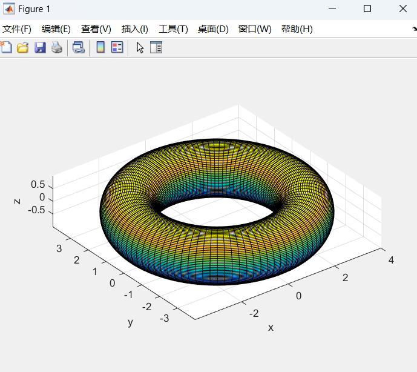
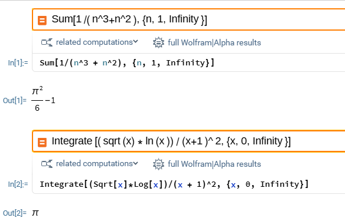

# 1. Python程序分析
### 1. 功能描述
该函数将符合"名称+数字"形式的文件夹名转换成(名称, 数字)的元组。  
输入: 一个形式为<name><value>的文件夹名，如'phi0.1'。  
输出: 一个内容为(name, value)的tuple，其中name的类型为string，value的类型为float。如('phi', 0.1)。  
注意：数字后面跟着一个'n'，则会被解读为负数。如find_name_value('kappa14.5n')返回('kappa', -14.5)。  

### 2. 测试、分析和修复
<b>测试用例：</b>  

```Python
if __name__ == '__main__':
    # normal inputs
    print(find_name_value('test66'))
    print(find_name_value('phi0.1'))
    print(find_name_value('kappa14.5n'))
    print(find_name_value('xN18n'))
    print()

    # abnormal inputs
    print(find_name_value('31.4'))
    print(find_name_value('hello'))
    print(find_name_value('5.8ABC'))
    print(find_name_value('xN+15'))
    print(find_name_value('hello123hi456.0'))
    print()

    # corner inputs
    print(find_name_value('0'))
    print(find_name_value('n'))
    print(find_name_value('n0'))
    print(find_name_value('0n'))
    print(find_name_value('n0n'))
    print(find_name_value('0n0'))
    print()

    print(find_name_value('-6n'))
```
<b>输出：</b>  

```
SyntaxWarning: invalid escape sequence '\d'
  pattern = '([-+]?\d*\.\d+|[-+]?\d+)'
('test', 66.0)
('phi', 0.1)
('kappa', -14.5)
('xN', -18.0)

('', 31.4)
('hello', None)
('', 5.8)
('xN', 15.0)
('hello', 123.0)

('', 0.0)
('n', None)
('n', 0.0)
('', -0.0)
('n', -0.0)
('', -0.0)

Traceback (most recent call last):
  File "c:\...\find.py", line 70, in <module>
    print(find_name_value('-6n'))
          ^^^^^^^^^^^^^^^^^^^^^^
  File "c:\...\find.py", line 42, in find_name_value
    return name, float(value)
                 ^^^^^^^^^^^^
ValueError: could not convert string to float: '--6'
```
<b>分析：</b>  
1. 出现了警告，因为`'([-+]?\d*\.\d+|[-+]?\d+)'`这个字符串中，'\'字符本身也需要被正确转义。  
2. 功能大体正确，但是在边界情况下可能会有漏洞。  
具体说来：如果字符串包含正号或符号，可能产生非预期的行为甚至出错。（毕竟，我们已经用'n'来指定负数了，不再需要正负号。）  
试题文档和函数注释中没有出现这种情况，因此如果认为这不算错，也是合理的。不过，既然单独把这个函数拿出来测试，为了保证鲁棒性，最好还是修复这个行为。  
3. （特别说明）从样例'hello123hi456.0'输出('hello', 123.0)，可以看到，如果重复出现了`<name><value><name><value>`等情况，该函数只会关注最前面的`<name><value>`对。  
试题文档和函数注释中也没有出现这种情况，这里我认为函数的这种行为是合理的。  

<b>修复：</b>  
1. 在正则表达式字符串前加上'r'，表示原始字符串：
2. 在正则表达式中删去关于正负号的部分。    
`pattern = r'(\d*\.\d+|\d+)'`  

### 3. 利用该函数找出文件夹名称对应变量名和值  
根据上文的分析和修复，输出的答案是：  
```
('phi', 0.1)  
('a', 1.0)  
```
<b>注意：</b>这是根据我们在“分析”中规定函数只关注第一个`<name><value>`对而导出的结果。如果我们认为这种行为不对（这没有在文档和注释中说明，因此这样想也不算错），修复后也可能会有别的结果。例如，如果我们认为函数应当将最后一组数字视为value、前面的都视为name，那么结果会是('phi0.1_xN14.2_kappa', -0.5)和('a1_b14n_n0_c', 0.2)。


# 2. Matlab作图  
```MATLAB
% 参数
R = 3;
r = 1;

theta = linspace(0, 2*pi, 100);
phi = linspace(0, 2*pi, 100);
[theta, phi] = meshgrid(theta, phi);

% 方程
x = (R + r * cos(theta)) .* cos(phi);
y = (R + r * cos(theta)) .* sin(phi);
z = r * sin(theta);

% 绘图
surf(x, y, z);
axis equal;     % 保持坐标轴比例
xlabel('x'); ylabel('y'); zlabel('z');
```




# 3. Mathematica  
## 1. 无穷级数求和
```Mathematica
Sum[1/(n^3+n^2), {n, 1, Infinity}]
```
$Result = \frac{\pi^2}{6} - 1$

## 2. 定积分
```Mathematica
Integrate[(sqrt(x) * ln(x)) / (x+1)^2, {x, 0, Infinity}]
```
$Result = \pi$




# 4. Markdown
$\mathrm{ \mathbf{Q}:~Find~the~solution~of~the~following~equation~with~respect~to~\theta: }$

$$
A~cos\theta + B~sin\theta + C = 0
$$

$\mathbf{A}\mathrm{:}$

$\mathrm{ let~\mathit{x}_1 = cos\theta~and~\mathit{x}_2 = sin\theta,~then~the~solution~is~given~by~the~intersection~of~the~circle~and~the~line: }$

$$
\begin{align*}
x_1^2 + x_2^2 = 1 \newline
Ax_1 + Bx_2 + C = 0
\end{align*}
$$

$\mathrm{ We~reformulate~the~equations~in~a~parametric~form: }$

$$
\begin{align*}
|\mathbf{x}|^2 = 1 \newline
\mathbf{x}(t) = \mathbf{a} + t\mathbf{b}
\end{align*}
$$

$\mathrm{ where~\mathbf{x} = (\mathit{x}_1, \mathit{x}_2),~\mathbf{a} = (0, −\mathit{C}/\mathit{B}), \mathbf{b} = (−\mathit{C}/\mathit{A}, \mathit{C}/\mathit{B}),~and~\mathit{t}~is~a~parameter.~The~intersection~points~satisfy}$
$\mathrm{ the~following~equation: }$

$$
|\mathbf{a} + t\mathbf{b}|^2 = 1
$$

$\mathrm{ which~can~be~solved~for~\mathit{t}~to~find~the~intersection~points: }$

$$
t_{1,2} = \frac{-\mathbf{a}\cdot\mathbf{b} \pm \sqrt{(\mathbf{a} \cdot \mathbf{b})^2 - |\mathbf{b}|^2(|\mathbf{a}|^2 - 1)}}{|\mathbf{b}|^2}
$$
